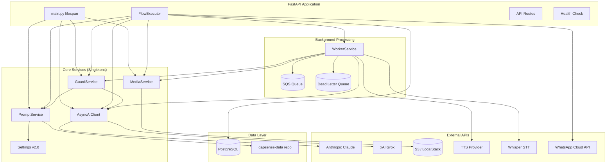
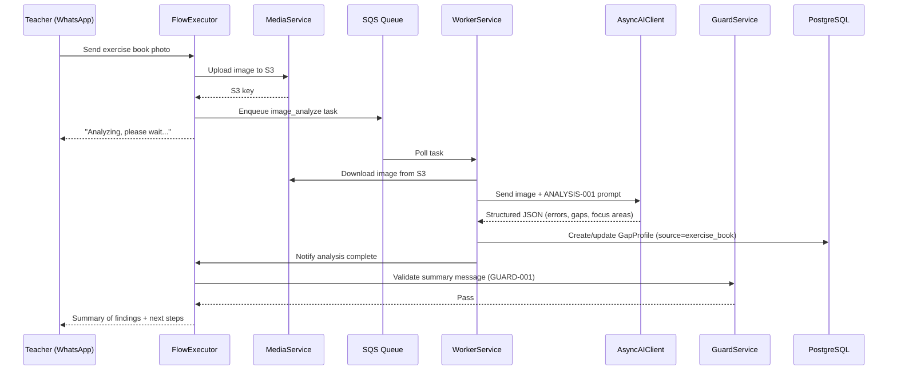
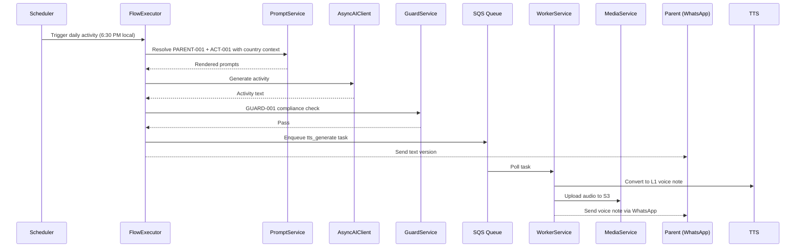
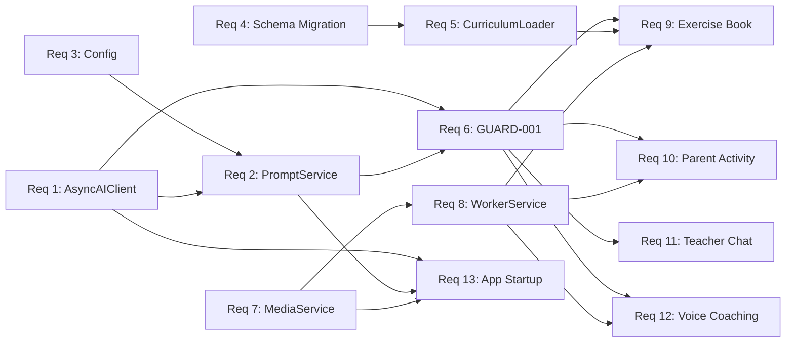

# Design Document: MVP Core Services

## Overview

This design covers the foundational service upgrades needed to transform GapSense from a single-country, synchronous, v1.1 platform into a multi-country, async, v2.0 platform. The 13 requirements form a dependency chain where infrastructure services (Async AI Client, Prompt Service, Config, Schema, Curriculum Loader) enable feature services (GUARD-001, S3 Media, Worker) which in turn enable user-facing features (Exercise Book Scanner, Parent Activity Delivery, Teacher Conversation, Voice Micro-Coaching).

The core architectural shift is:
1. **Sync → Async**: Replace the synchronous `AIClient` with an async singleton using `AsyncAnthropic`, connection pooling, retry, and semaphore-based concurrency control.
2. **Single-country → Multi-country**: Parameterize all data paths, prompts, and database models with country/subject/level dimensions.
3. **2 prompts → 13 prompts**: Upgrade from v1.1 prompt library (2 wired prompts) to v2.0 multi-country library with template resolution for `{{country}}`, `{{curriculum_authority}}`, `{{common_foods}}`, etc.
4. **Monolithic processing → Worker-based**: Add SQS-backed background processing for TTS, image analysis, transcription, and scheduled delivery.

## Architecture

### High-Level Component Diagram



### Data Flow: Exercise Book Scan (Req 9)



### Data Flow: Parent Activity Delivery with TTS (Req 10)



### Dependency Chain



## Components and Interfaces

### 1. AsyncAIClient (`gapsense/src/gapsense/ai/client.py`)

Replaces the current synchronous `AIClient`. Uses a shared `AsyncAnthropic` instance with connection pooling.

```python
class AsyncAIClient:
    """Async AI client with retry, fallback, concurrency control, and multimodal support."""

    def __init__(
        self,
        anthropic_api_key: str,
        grok_api_key: str | None = None,
        max_concurrent: int = 10,
        timeout_seconds: float = 30.0,
        max_retries: int = 3,
    ): ...

    async def generate(
        self,
        *,
        prompt_id: str,
        system: str,
        messages: list[dict[str, Any]],
        model: str = "claude-sonnet-4-5-20250929",
        max_tokens: int = 2048,
        temperature: float = 0.3,
        json_mode: bool = False,
        images: list[ImageContent] | None = None,
    ) -> AIResponse | None:
        """Generate completion with retry, fallback, and logging.

        Returns None when all providers fail (signals rule-based fallback).
        """
        ...

    async def close(self) -> None:
        """Close HTTP connection pools."""
        ...

@dataclass
class ImageContent:
    """Image content for multimodal requests."""
    data: str          # base64 or URL
    media_type: str    # image/jpeg, image/png, image/webp
    source_type: str   # "base64" or "url"

@dataclass
class AIResponse:
    """Structured response from AI provider."""
    text: str
    provider: str           # "anthropic" or "grok"
    model: str
    prompt_id: str
    latency_ms: float
    input_tokens: int
    output_tokens: int
    json_parsed: dict[str, Any] | None = None  # Populated when json_mode=True
```

**Retry logic**: Exponential backoff (1s, 2s, 4s) on transient errors (429, 500, 502, 503, 529). Uses `asyncio.Semaphore(max_concurrent)` for concurrency control. `asyncio.wait_for(timeout_seconds)` for per-request timeouts.

### 2. PromptService (`gapsense/src/gapsense/ai/prompt_service.py`)

New service that wraps the existing `PromptLibrary` with multi-country template resolution.

```python
class PromptService:
    """Multi-country prompt service with template resolution."""

    def __init__(self, settings: Settings): ...

    def render_prompt(
        self,
        prompt_id: str,
        *,
        country: str,
        language: str | None = None,
        extra_context: dict[str, str] | None = None,
    ) -> RenderedPrompt:
        """Load prompt, resolve country placeholders, inject L1 context.

        Raises:
            ValueError: If country or language not supported.
        """
        ...

    def get_supported_countries(self) -> list[str]: ...
    def get_supported_languages(self, country: str) -> list[str]: ...
    def list_prompts(self) -> list[str]: ...

@dataclass
class RenderedPrompt:
    """Fully resolved prompt ready for AI client."""
    prompt_id: str
    system_prompt: str
    user_template: str | None
    model: str
    temperature: float
    max_tokens: int
    country: str
    language: str | None
```

**Template resolution order**:
1. Load raw prompt from v2.0 library
2. Substitute `{{country}}`, `{{curriculum_authority}}`, `{{common_foods}}`, `{{common_names}}`, `{{household_materials}}`, `{{currency}}`, `{{geographic_contexts}}` from `country_config`
3. If language specified, inject L1 greetings, encouragement, math vocabulary from `languages/{country}/{lang}.json`
4. Substitute any `extra_context` key-value pairs
5. Validate zero unresolved `{{...}}` placeholders remain

### 3. Settings v2.0 (`gapsense/src/gapsense/config.py`)

Extends existing `Settings` with new computed properties for v2.0 data paths.

```python
# New properties added to existing Settings class:

@property
def prompt_library_path(self) -> Path:
    """v2.0 multi-country prompt library."""
    return self.GAPSENSE_DATA_PATH / "prompts" / "gapsense_prompt_library_v2.0_multicountry.json"

@property
def curricula_base_path(self) -> Path:
    """Multi-country curricula directory."""
    return self.GAPSENSE_DATA_PATH / "curricula"

@property
def cultural_context_path(self) -> Path:
    """Cultural context files directory."""
    return self.GAPSENSE_DATA_PATH / "cultural_context"

@property
def languages_base_path(self) -> Path:
    """L1 language files directory."""
    return self.GAPSENSE_DATA_PATH / "languages"

# prerequisite_graph_path retained for backward compatibility
```

**Validator change**: `validate_data_path` checks for `curricula/` (plural) instead of `curriculum/` (singular).

### 4. Database Schema Migration

Alembic migration adding columns to `CurriculumNode` and `GapProfile`.

**CurriculumNode changes**:
- Add `country: String(5)` — ISO country code, default `"GH"` for existing rows
- Add `subject: String(50)` — subject name
- Add `level: String(20)` — education level
- Add composite index on `(country, subject, level, grade)`

**GapProfile changes**:
- Make `session_id` nullable (currently non-nullable, blocking non-diagnostic gap sources)
- Add `source: String(30)` — origin of gap profile, default `"diagnostic"`
- Add check constraint: when `session_id IS NULL`, `source` must be non-empty and not `"diagnostic"`

### 5. CurriculumLoader (`gapsense/src/gapsense/services/curriculum_loader.py`)

New service replacing `scripts/load_curriculum.py`. Walks the multi-country directory tree.

```python
class CurriculumLoader:
    """Multi-country curriculum loader with upsert logic."""

    def __init__(self, db_session: AsyncSession, settings: Settings): ...

    async def load_all_countries(self) -> LoadSummary:
        """Walk curricula/{country}/{level}/{subject}/ and load all nodes."""
        ...

    async def load_country(self, country_code: str) -> LoadSummary:
        """Load curriculum for a single country."""
        ...

@dataclass
class LoadSummary:
    """Summary of curriculum loading operation."""
    total_files: int
    total_nodes_created: int
    total_nodes_updated: int
    total_errors: int
    by_country: dict[str, CountrySummary]

@dataclass
class CountrySummary:
    files: int
    nodes_created: int
    nodes_updated: int
    errors: int
    by_subject: dict[str, int]
```

**Directory walking**: `curricula/{country}/{level}/{subject}/*.json` → parse object-based JSON (`{"B2.1.1.1": {...}}`) → upsert `CurriculumNode` with `country`, `subject`, `level` from path.

### 6. GuardService (`gapsense/src/gapsense/services/guard_service.py`)

```python
class GuardService:
    """GUARD-001 compliance gate for parent-facing messages."""

    def __init__(self, ai_client: AsyncAIClient, prompt_service: PromptService): ...

    async def check(
        self,
        message: str,
        *,
        student_context: dict[str, Any],
        country: str,
        language: str,
    ) -> GuardResult:
        """Validate message against Wolf/Aurino dignity-first principles.

        Blocks message if AI client unavailable (fail-closed).
        """
        ...

@dataclass
class GuardResult:
    passed: bool
    original_message: str
    violations: list[str]       # Empty if passed
    latency_ms: float
    ai_available: bool          # False if all providers failed
```

**Key design decision**: Fail-closed. If the AI client returns `None` (all providers down), the message is blocked and a `compliance-check-unavailable` event is logged. This ensures no unvalidated message reaches a parent.

### 7. MediaService (`gapsense/src/gapsense/services/media_service.py`)

```python
class MediaService:
    """S3 media service for images and audio."""

    def __init__(self, settings: Settings): ...

    async def upload(
        self,
        content: bytes,
        *,
        country: str,
        student_id: str,
        media_type: str,       # "image" or "audio"
        filename: str,
        content_type: str,
    ) -> str:
        """Upload to S3, return S3 key. Validates content type and size."""
        ...

    async def generate_download_url(self, s3_key: str, expiry_seconds: int = 3600) -> str: ...
    async def generate_upload_url(self, s3_key: str, content_type: str, expiry_seconds: int = 900) -> str: ...
    async def download(self, s3_key: str) -> bytes: ...
```

**S3 key format**: `{country}/{student_id}/{media_type}/{timestamp}_{filename}`
**Content type validation**: Images: `image/jpeg`, `image/png`, `image/webp`. Audio: `audio/ogg`, `audio/mpeg`, `audio/wav`, `audio/mp4`.
**Size limits**: Images: 10 MB. Audio: 25 MB.
**Environment switching**: Uses `S3_ENDPOINT_URL` env var — `http://localstack:4566` locally, omitted in production (uses default AWS endpoint).

### 8. WorkerService (`gapsense/src/gapsense/services/worker_service.py`)

```python
class WorkerService:
    """SQS-backed background task processor."""

    def __init__(
        self,
        ai_client: AsyncAIClient,
        media_service: MediaService,
        guard_service: GuardService,
        prompt_service: PromptService,
        settings: Settings,
        max_concurrent: int = 5,
    ): ...

    async def start(self) -> None:
        """Start long-polling SQS consumer loop."""
        ...

    async def stop(self) -> None:
        """Graceful shutdown."""
        ...

    async def enqueue(self, task: WorkerTask) -> str:
        """Send task to SQS queue. Returns message ID."""
        ...

@dataclass
class WorkerTask:
    task_type: str          # tts_generate, image_analyze, scheduled_message, voice_transcribe
    payload: dict[str, Any]
    retry_count: int = 0
    max_retries: int = 3
```

**Task routing**: Each `task_type` maps to a handler method. Failed tasks are returned to the queue with incremented `retry_count` and exponential backoff visibility timeout. After `max_retries`, moved to DLQ.

### 9. Application Startup (`gapsense/src/gapsense/main.py`)

Updated lifespan handler:

```python
@asynccontextmanager
async def lifespan(app: FastAPI):
    # 1. Initialize AsyncAIClient singleton
    ai_client = AsyncAIClient(...)

    # 2. Initialize PromptService (loads v2.0 prompts, country configs, cultural contexts, languages)
    prompt_service = PromptService(settings)

    # 3. Initialize MediaService and verify S3 connectivity
    media_service = MediaService(settings)
    await media_service.verify_connectivity()

    # 4. Initialize GuardService
    guard_service = GuardService(ai_client, prompt_service)

    # 5. Verify database connectivity
    # 6. Store services in app.state for dependency injection

    yield

    # Shutdown: close AI client connection pool, release resources
    await ai_client.close()
```

**Health check** updated to report: database status, prompt library (version + count), AI client readiness, S3 connectivity.

## Data Models

### Updated CurriculumNode

```python
class CurriculumNode(Base, UUIDPrimaryKeyMixin, TimestampMixin):
    __table_args__ = (
        # Existing indexes...
        Index("idx_curriculum_nodes_country_subject_level_grade", "country", "subject", "level", "grade"),
    )

    # Existing columns...
    code: Mapped[str]           # "B2.1.1.1"
    grade: Mapped[str]          # "B2"
    title: Mapped[str]
    description: Mapped[str]
    severity: Mapped[int]
    # ...

    # NEW columns
    country: Mapped[str] = mapped_column(String(5), nullable=False, default="GH")
    subject: Mapped[str] = mapped_column(String(50), nullable=False, default="mathematics")
    level: Mapped[str] = mapped_column(String(20), nullable=False, default="primary")
```

### Updated GapProfile

```python
class GapProfile(Base, UUIDPrimaryKeyMixin):
    # Existing columns...
    student_id: Mapped[UUID]

    # CHANGED: nullable
    session_id: Mapped[UUID | None] = mapped_column(
        PG_UUID(as_uuid=True),
        ForeignKey("diagnostic_sessions.id"),
        nullable=True,  # Was: nullable=False
    )

    # NEW column
    source: Mapped[str] = mapped_column(
        String(30),
        nullable=False,
        default="diagnostic",
        comment="Origin: diagnostic, exercise_book, teacher_report, voice_coaching",
    )

    # Existing columns...
    mastered_nodes: Mapped[list[UUID]]
    gap_nodes: Mapped[list[UUID]]
    # ...
```

### Country Config (In-Memory)

```python
@dataclass
class CountryConfig:
    """Loaded from country_config.json + prompt library country_config section."""
    country_code: str               # "GH", "UG", "KE", "NG"
    country_name: str               # "Ghana"
    curriculum_authority: str        # "NaCCA"
    currency: str                   # "GH₵ (cedis)"
    common_foods: list[str]
    common_names: list[str]
    household_materials: list[str]
    geographic_contexts: list[str]
    active_levels: list[str]        # ["primary"]
    active_subjects: dict[str, list[str]]  # {"primary": ["mathematics"]}
    supported_languages: list[str]  # ["en", "tw", "ee", "ga", "dag"]
    timezone: str                   # "GMT"
```

### L1 Language Context (In-Memory)

```python
@dataclass
class L1LanguageContext:
    """Loaded from languages/{country}/{lang}.json."""
    language_code: str          # "tw"
    language_name: str          # "Twi (Akan)"
    greetings: list[str]
    encouragement_phrases: list[str]
    math_vocabulary: dict[str, str]
    materials: dict[str, str]
    action_verbs: dict[str, str]
```

### Worker Task Payloads

```python
# tts_generate
{"text": str, "language": str, "country": str, "student_id": str, "parent_phone": str}

# image_analyze
{"s3_key": str, "student_id": str, "teacher_phone": str, "country": str}

# scheduled_message
{"message": str, "recipient_phone": str, "country": str, "language": str, "student_context": dict}

# voice_transcribe
{"s3_key": str, "parent_id": str, "student_id": str, "country": str, "language": str}
```


## Correctness Properties

*A property is a characteristic or behavior that should hold true across all valid executions of a system — essentially, a formal statement about what the system should do. Properties serve as the bridge between human-readable specifications and machine-verifiable correctness guarantees.*

### Property 1: AI Client Retry Count

*For any* sequence of transient errors (HTTP 429, 500, 502, 503, 529) from the Anthropic API, the AI client should make at most 4 total attempts (1 initial + 3 retries) before giving up on that provider. If the number of consecutive transient errors is N, the total attempts should be `min(N+1, 4)` when N < 4, and exactly 4 when N >= 4.

**Validates: Requirements 1.3**

### Property 2: Provider Cascade Fallback

*For any* AI request, when the primary Anthropic provider fails after all retries, the client should attempt the Grok fallback provider. When both providers fail, the client should return `None`. The result is non-None if and only if at least one provider succeeded.

**Validates: Requirements 1.7, 1.8**

### Property 3: AI Concurrency Limit

*For any* batch of N simultaneous AI requests where N exceeds the configured concurrency limit, the number of in-flight requests at any point in time should never exceed the semaphore limit.

**Validates: Requirements 1.9**

### Property 4: AI Call Logging Completeness

*For any* AI API call (successful or failed), the emitted log record should contain: provider name, prompt_id, latency in milliseconds, token usage, and success/failure status.

**Validates: Requirements 1.10**

### Property 5: Prompt Template Resolution Round-Trip

*For any* valid prompt template and *any* supported country config (with optional language), rendering the template should produce a string with zero unresolved `{{...}}` placeholders. All `{{country}}`, `{{curriculum_authority}}`, `{{common_foods}}`, `{{common_names}}`, `{{household_materials}}`, `{{currency}}`, and `{{geographic_contexts}}` placeholders should be substituted with values from the country config, and L1 content should be injected when a language is specified.

**Validates: Requirements 2.5, 2.6, 2.10**

### Property 6: Unsupported Country/Language Rejection

*For any* country string not in the supported countries list, or *any* language string not in a given country's supported languages list, calling `render_prompt` should raise a `ValueError` containing the list of valid options.

**Validates: Requirements 2.7, 2.8**

### Property 7: Curriculum Loader Path-to-Column Mapping

*For any* curriculum file located at `curricula/{country}/{level}/{subject}/file.json`, every `CurriculumNode` loaded from that file should have its `country`, `level`, and `subject` columns set to the values extracted from the directory path.

**Validates: Requirements 5.1, 5.2, 5.3**

### Property 8: Curriculum Loader Idempotence

*For any* set of curriculum files, loading the same files twice should result in the same total number of `CurriculumNode` rows in the database as loading them once. The second load should produce zero new nodes and only updates.

**Validates: Requirements 5.5**

### Property 9: Curriculum Loader Error Resilience

*For any* set of curriculum files where some contain invalid JSON, the loader should successfully process all valid files and the `LoadSummary.total_errors` count should equal the number of invalid files, while `total_files` equals the total number of files attempted.

**Validates: Requirements 5.6, 5.7**

### Property 10: Guard Service Pass-Through Invariant

*For any* message that passes the GUARD-001 compliance check, the `GuardResult.original_message` should be identical to the input message, and `GuardResult.passed` should be `True` with an empty violations list.

**Validates: Requirements 6.3**

### Property 11: Guard Service Fail-Closed

*For any* message checked when the AI client is unavailable (returns `None`), the `GuardResult.passed` should be `False` and `GuardResult.ai_available` should be `False`. No message should pass the guard when AI is unavailable.

**Validates: Requirements 6.5**

### Property 12: Guard Service Logging Completeness

*For any* guard compliance check (pass or fail), the emitted log record should contain: prompt_id, pass/fail result, latency in milliseconds, and violation categories (empty list if passed).

**Validates: Requirements 6.7**

### Property 13: Media Upload Validation

*For any* upload request, the `MediaService` should reject content types not in the allowed set for the given media type (images: `image/jpeg`, `image/png`, `image/webp`; audio: `audio/ogg`, `audio/mpeg`, `audio/wav`, `audio/mp4`). Additionally, *for any* file exceeding 10 MB for images or 25 MB for audio, the upload should be rejected.

**Validates: Requirements 7.4, 7.5, 7.8**

### Property 14: S3 Key Format

*For any* upload with parameters (country, student_id, media_type, filename), the generated S3 key should match the pattern `{country}/{student_id}/{media_type}/{timestamp}_{filename}` where timestamp is a valid ISO-format or epoch string.

**Validates: Requirements 7.1**

### Property 15: Media Upload Retry

*For any* sequence of S3 upload failures, the `MediaService` should make at most 3 total attempts (1 initial + 2 retries) before returning an error.

**Validates: Requirements 7.6**

### Property 16: Worker Task Retry Lifecycle

*For any* failed worker task with `retry_count < max_retries`, the task should be re-enqueued with `retry_count + 1` and an exponential backoff visibility timeout. *For any* failed task with `retry_count >= max_retries`, the task should be moved to the dead-letter queue.

**Validates: Requirements 8.7, 8.8**

### Property 17: Worker Concurrency Limit

*For any* batch of tasks exceeding the configured concurrency limit, the number of concurrently processing tasks should never exceed the limit.

**Validates: Requirements 8.9**

### Property 18: GapProfile Source Constraint

*For any* `GapProfile` created without a `session_id` (i.e., `session_id` is `None`), the `source` column must contain a non-empty string that is not `"diagnostic"`.

**Validates: Requirements 4.8**

### Property 19: Health Check Response Completeness

*For any* call to the health check endpoint, the response should contain status entries for: database, prompt_library (with version and prompt count), AI client readiness, and S3 connectivity.

**Validates: Requirements 13.4**

### Property 20: Startup Failure Blocks Application

*For any* startup scenario where a critical service (database or prompt library) fails to initialize, the application should raise an exception and refuse to start.

**Validates: Requirements 13.6**

## Error Handling

### AI Client Errors

| Error | Handling | Fallback |
|-------|----------|----------|
| Transient HTTP (429, 500, 502, 503, 529) | Retry up to 3x with exponential backoff (1s, 2s, 4s) | Fall back to Grok provider |
| Timeout (>30s) | Cancel request, log timeout | Fall back to Grok provider |
| Authentication error (401, 403) | No retry, log error | Fall back to Grok provider |
| Grok also fails | Return `None` | Rule-based fallback in FlowExecutor |
| Rate limit exceeded | Semaphore prevents over-saturation; 429 triggers retry | Backoff + Grok fallback |

### Guard Service Errors

| Error | Handling |
|-------|----------|
| AI client returns None | **Block message** (fail-closed), log `compliance-check-unavailable` |
| AI response unparseable | Block message, log parsing error |
| Timeout (>5s) | Block message, log timeout |

### Media Service Errors

| Error | Handling |
|-------|----------|
| Invalid content type | Reject immediately with descriptive error |
| File too large | Reject immediately with size limit info |
| S3 upload failure | Retry 2x with exponential backoff, then return error |
| S3 connectivity lost | Health check reports unhealthy, uploads queue for retry |

### Worker Service Errors

| Error | Handling |
|-------|----------|
| Task processing failure | Re-enqueue with `retry_count + 1`, exponential backoff visibility timeout |
| Max retries exceeded (3) | Move to dead-letter queue, log failure details |
| SQS connectivity lost | Exponential backoff on poll, health check reports unhealthy |

### Curriculum Loader Errors

| Error | Handling |
|-------|----------|
| Invalid JSON file | Log file path + error, continue loading remaining files |
| Missing country_config.json | Skip country, log warning |
| Database constraint violation | Log node code + error, continue with next node |

### Application Startup Errors

| Error | Handling |
|-------|----------|
| Database unreachable | Refuse to start, log descriptive error |
| Prompt library file missing | Refuse to start, log file path |
| S3/LocalStack unreachable | Log warning, start with degraded media service |
| AI client keys missing | Log warning, start with no AI capability |

## Testing Strategy

### Testing Framework

- **Unit tests**: `pytest` with `pytest-asyncio` for async test support
- **Property-based tests**: `hypothesis` library (Python's standard PBT library)
- **Mocking**: `unittest.mock` / `pytest-mock` for external service mocks
- **Database tests**: `pytest` with test database and Alembic migrations applied

### Property-Based Testing Configuration

- Library: **Hypothesis** (`hypothesis` Python package)
- Minimum iterations: **100 per property** (`@settings(max_examples=100)`)
- Each property test must reference its design document property with a comment tag:
  ```python
  # Feature: mvp-core-services, Property 5: Prompt Template Resolution Round-Trip
  ```
- Each correctness property is implemented by a **single** property-based test function
- Custom strategies for domain types: `CountryConfig`, `PromptTemplate`, `WorkerTask`, `ImageContent`

### Unit Test Coverage

Unit tests cover specific examples, edge cases, and integration points:

- **AI Client**: Mock Anthropic/Grok APIs, test specific error codes, timeout behavior, JSON mode parameter passing, image content block construction
- **Prompt Service**: Test with real v2.0 prompt library file, verify all 13 prompts load, test specific country/language combinations
- **Config**: Test all path properties resolve correctly, test validator with missing directories
- **Schema Migration**: Apply migration to test DB, verify columns exist, verify defaults
- **Curriculum Loader**: Test with sample curriculum files, verify upsert behavior, test with real Ghana data
- **Guard Service**: Mock AI client responses (pass/fail/None), verify fail-closed behavior
- **Media Service**: Mock S3 client (or use LocalStack), test upload/download, presigned URLs
- **Worker Service**: Mock SQS, test task routing, retry logic, DLQ behavior
- **Health Check**: Test with various service states (all healthy, some unhealthy)

### Integration Test Coverage

- **End-to-end exercise book scan**: WhatsApp image → S3 upload → SQS → Worker → AI analysis → GapProfile update → WhatsApp response
- **End-to-end parent activity delivery**: Scheduler → PromptService → AI → Guard → TTS → WhatsApp
- **Startup/shutdown lifecycle**: Verify all services initialize and clean up correctly

### Test Organization

```
tests/
├── unit/
│   ├── test_ai_client.py          # Properties 1-4
│   ├── test_prompt_service.py     # Properties 5-6
│   ├── test_curriculum_loader.py  # Properties 7-9
│   ├── test_guard_service.py      # Properties 10-12
│   ├── test_media_service.py      # Properties 13-15
│   ├── test_worker_service.py     # Properties 16-17
│   ├── test_gap_profile.py        # Property 18
│   └── test_health_check.py       # Properties 19-20
├── integration/
│   ├── test_exercise_book_flow.py
│   ├── test_parent_activity_flow.py
│   └── test_startup_lifecycle.py
└── conftest.py                    # Shared fixtures, Hypothesis strategies
```
