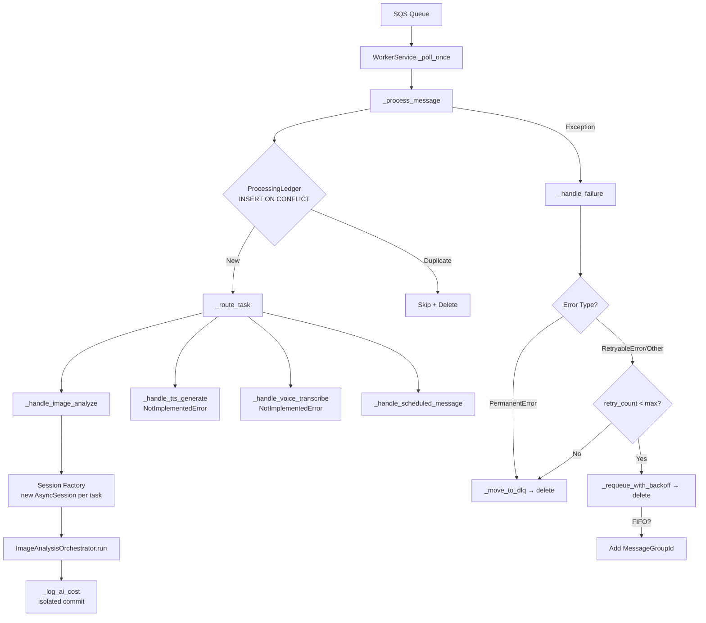

# Design Document: Phase 1 Infrastructure Hardening

## Overview

This design covers seven infrastructure bug fixes to the SQS-backed `WorkerService` and four prompt surgery items for the ANALYSIS-001 prompt and AI model strings. The changes harden the image analysis pipeline against session corruption, duplicate processing, message loss, and FIFO queue errors while updating model identifiers and prompt content for improved AI analysis quality.

All changes are backwards compatible with in-flight SQS messages. The scope is limited to `worker_service.py`, `image_analysis_orchestrator.py`, a new `exceptions.py` module, a new `ProcessingLedger` model + Alembic migration, model string updates across 6 files, and prompt library JSON edits.

## Architecture

The existing architecture is an SQS-backed worker that polls messages, routes them to task handlers, and manages retries with exponential backoff and DLQ delivery. The image analysis handler delegates to a 6-step `ImageAnalysisOrchestrator` pipeline.



### Key Architectural Changes

1. **Session Factory Injection** — Replace shared `db` parameter with `session_factory: async_sessionmaker` so each task gets an isolated `AsyncSession`. This eliminates cross-task transaction corruption.

2. **Idempotency Guard** — New `ProcessingLedger` table with `INSERT ... ON CONFLICT DO NOTHING` on `(sqs_message_id, task_type)` prevents duplicate processing of redelivered SQS messages.

3. **Exception Hierarchy** — New `GapSenseError → RetryableError | PermanentError` hierarchy enables `_handle_failure` to route permanent failures directly to DLQ without wasting retries.

4. **Safe Requeue Ordering** — Reverse the delete-then-requeue order in `_handle_failure` to requeue/DLQ-first, then delete. If requeue fails, the original message survives for SQS redelivery.

5. **FIFO Queue Support** — Conditionally add `MessageGroupId` (set to `task_type`) when queue URL ends with `.fifo`.

## Components and Interfaces

### 1. WorkerService Constructor Change

**File:** `gapsense/src/gapsense/services/worker_service.py`

Current signature:
```python
def __init__(self, ..., db: Any = None, ...) -> None:
```

New signature:
```python
def __init__(self, ..., session_factory: Any = None, ...) -> None:
    self._session_factory = session_factory
```

The `_process_message` method creates a per-task session:
```python
async def _process_message(self, msg: dict[str, Any]) -> None:
    # ... parse task ...
    if self._session_factory:
        async with self._session_factory() as db:
            # idempotency check + route task with db
    else:
        # route task without db (e.g., scheduled_message)
```

Handlers that need DB receive it explicitly. `_handle_image_analyze` already creates its own session via `AsyncSessionLocal` — this is kept consistent by using `self._session_factory` instead of the hardcoded import.

### 2. Exception Hierarchy

**New file:** `gapsense/src/gapsense/core/exceptions.py`

```python
class GapSenseError(Exception):
    """Base exception for all GapSense domain errors."""

class RetryableError(GapSenseError):
    """Transient failure — retry with backoff."""

class PermanentError(GapSenseError):
    """Non-recoverable failure — route to DLQ immediately."""

class StudentNotFoundError(PermanentError): ...
class CurriculumDataError(PermanentError): ...
class MediaDownloadError(RetryableError): ...
class AIClientError(RetryableError): ...
```

### 3. ProcessingLedger Model

**New file:** `gapsense/src/gapsense/core/models/processing_ledger.py`

SQLAlchemy model with `INSERT ... ON CONFLICT DO NOTHING` via `sqlalchemy.dialects.postgresql.insert`.

### 4. _handle_failure Rewrite

The method is restructured to:
1. Classify the error (`PermanentError` → DLQ, else → retry logic)
2. Requeue or DLQ-send first (before deleting original)
3. Only delete original after successful requeue/DLQ-send
4. If requeue/DLQ-send fails, do NOT delete — SQS redelivers

### 5. FIFO Queue Support

Both `_requeue_with_backoff` and `_move_to_dlq` check `queue_url.endswith(".fifo")` and conditionally add `MessageGroupId=task.task_type` to the `send_message` kwargs.

### 6. Stub Handler Honesty

`_handle_tts_generate` and `_handle_voice_transcribe` raise `NotImplementedError` with descriptive messages. `_route_task` validates `task_type` against `TASK_TYPES` frozenset before handler lookup, raising `ValueError` for unknown types.

### 7. AIUsageLog Commit Isolation

`_log_ai_cost` already has the correct pattern (try/commit/except/rollback/log). The design verifies this is correct and ensures no `flush()`-only path exists.

### 8. Model String Updates

| File | Current | New |
|------|---------|-----|
| `async_client.py` (generate default) | `claude-sonnet-4-5-20250929` | `claude-sonnet-4-6` |
| `prompt_service.py` (fallback) | `claude-sonnet-4-5` | `claude-sonnet-4-6` |
| `prompt_loader.py` (get_prompt_config fallback) | `claude-sonnet-4-5` | `claude-sonnet-4-6` |
| `models/prompts.py` (model_target default) | `claude-sonnet-4-5` | `claude-sonnet-4-6` |
| `models/diagnostics.py` (model_used comment) | `claude-sonnet-4-5` | `claude-sonnet-4-6` |
| `cost_calculator.py` | Add `claude-sonnet-4-6` entry, update `claude-haiku-4-5` key to `claude-haiku-4-5-20251001` | New pricing entries |
| Prompt library JSON | All `claude-sonnet-4-5` model fields | `claude-sonnet-4-6` |
| Prompt library JSON metadata | `model_target: claude-sonnet-4-5-20250929` | `claude-sonnet-4-6` |

### 9. Prompt Library Changes (ANALYSIS-001)

All changes are in `gapsense-data/prompts/gapsense_prompt_library_v2.0_multicountry.json`:

- **Few-shot example**: Insert a complete Ghana Basic 7 Pythagoras analysis example between CURRICULUM CODE VALIDATION and OUTPUT FORMAT sections
- **Output schema extension**: Add optional `retrieval_metadata` and `transcription_attempt` fields (nullable, default null)
- **Visual analysis rules**: Add rules for two-page spreads, multiple handwriting styles, scattered layouts, and partially readable content

### 10. worker/main.py Entrypoint Update

Change constructor call from `db=None` to `session_factory=AsyncSessionLocal`:
```python
from gapsense.core.database import AsyncSessionLocal

worker_service = WorkerService(
    ...,
    session_factory=AsyncSessionLocal,
    ...
)
```

## Data Models

### ProcessingLedger Table

```python
class ProcessingLedger(Base):
    __tablename__ = "processing_ledger"
    __table_args__ = (
        UniqueConstraint("sqs_message_id", "task_type", name="uq_ledger_msg_task"),
        Index("idx_ledger_expires", "expires_at"),
    )

    id: Mapped[UUID] = mapped_column(primary_key=True, default=uuid4)
    sqs_message_id: Mapped[str] = mapped_column(String(255), nullable=False)
    task_type: Mapped[str] = mapped_column(String(64), nullable=False)
    status: Mapped[str] = mapped_column(String(20), default="processing")
    student_id: Mapped[UUID | None] = mapped_column(PG_UUID(as_uuid=True), nullable=True)
    started_at: Mapped[datetime] = mapped_column(
        DateTime(timezone=True), server_default=text("NOW()"), nullable=False
    )
    completed_at: Mapped[datetime | None] = mapped_column(
        DateTime(timezone=True), nullable=True
    )
    expires_at: Mapped[datetime] = mapped_column(
        DateTime(timezone=True),
        server_default=text("NOW() + INTERVAL '48 hours'"),
        nullable=False,
    )
```

The idempotency check uses PostgreSQL's `INSERT ... ON CONFLICT DO NOTHING`:

```python
from sqlalchemy.dialects.postgresql import insert as pg_insert

stmt = pg_insert(ProcessingLedger).values(
    sqs_message_id=task.message_id,
    task_type=task.task_type,
    student_id=payload.get("student_id"),
).on_conflict_do_nothing(constraint="uq_ledger_msg_task")

result = await db.execute(stmt)
await db.commit()

if result.rowcount == 0:
    # Duplicate — skip processing
    logger.warning("duplicate_message_skipped", sqs_message_id=task.message_id)
    await self._delete_message(task.receipt_handle)
    return
```

### Alembic Migration

New migration file following existing naming convention: `YYYYMMDD_HHMM_{revision}_add_processing_ledger.py`

Creates the `processing_ledger` table with:
- `id` UUID PK
- `sqs_message_id` VARCHAR(255) NOT NULL
- `task_type` VARCHAR(64) NOT NULL
- `status` VARCHAR(20) DEFAULT 'processing'
- `student_id` UUID nullable
- `started_at` TIMESTAMPTZ DEFAULT NOW()
- `completed_at` TIMESTAMPTZ nullable
- `expires_at` TIMESTAMPTZ DEFAULT NOW() + INTERVAL '48 hours'
- UNIQUE constraint on `(sqs_message_id, task_type)`
- Index on `expires_at` for cleanup queries

### ANALYSIS-001 Output Schema Extension

Two new optional fields added to the output schema in the prompt library JSON:

```json
{
  "retrieval_metadata": {
    "type": "object",
    "nullable": true,
    "default": null,
    "description": "Reserved for Phase 2 retrieval-augmented curriculum lookup"
  },
  "transcription_attempt": {
    "type": "object",
    "nullable": true,
    "default": null,
    "description": "Reserved for Phase 3 OCR transcription data"
  }
}
```

These are additive-only changes — no existing fields are modified or removed.

### Cost Calculator Pricing Updates

```python
ANTHROPIC_PRICING = {
    # ... existing entries ...
    "claude-sonnet-4-6": {
        "input": Decimal("3.00"),
        "output": Decimal("15.00"),
    },
    "claude-haiku-4-5-20251001": {
        "input": Decimal("1.00"),
        "output": Decimal("5.00"),
    },
    # Keep old key for backwards compat with in-flight logs
    "claude-haiku-4-5": {
        "input": Decimal("1.00"),
        "output": Decimal("5.00"),
    },
}
```

## Correctness Properties

*A property is a characteristic or behavior that should hold true across all valid executions of a system — essentially, a formal statement about what the system should do. Properties serve as the bridge between human-readable specifications and machine-verifiable correctness guarantees.*

### Property 1: Session lifecycle isolation

*For any* SQS message processed by `_process_message` when a session_factory is provided, a new `AsyncSession` SHALL be created before task routing and closed after the task completes or fails, regardless of the outcome.

**Validates: Requirements 1.2, 1.4**

### Property 2: Duplicate message idempotency

*For any* SQS message ID that has already been inserted into the ProcessingLedger for a given task_type, a second processing attempt with the same `(sqs_message_id, task_type)` SHALL skip task execution, delete the SQS message, and not modify any application state.

**Validates: Requirements 2.4**

### Property 3: Ledger status reflects task outcome

*For any* task processed through the WorkerService, the ProcessingLedger row status SHALL be `"completed"` with a non-null `completed_at` if the task succeeded, or `"failed"` if the task was routed to the DLQ.

**Validates: Requirements 2.5, 2.6**

### Property 4: Cost logging isolation

*For any* AI response processed by `_log_ai_cost`, if the database commit raises an exception, the orchestrator pipeline SHALL continue execution without re-raising, and the session SHALL be rolled back.

**Validates: Requirements 3.2**

### Property 5: Stub handlers signal non-implementation

*For any* invocation of `_handle_tts_generate` or `_handle_voice_transcribe` with any valid `WorkerTask`, the handler SHALL raise `NotImplementedError`.

**Validates: Requirements 4.1, 4.2**

### Property 6: Unknown task type rejection

*For any* string not present in the `TASK_TYPES` frozenset, calling `_route_task` with that task_type SHALL raise `ValueError` containing the unknown task type string.

**Validates: Requirements 4.3**

### Property 7: Error classification routing

*For any* exception passed to `_handle_failure`, if the exception is an instance of `PermanentError`, the task SHALL be moved to the DLQ regardless of `retry_count`. If the exception is a `RetryableError` or any other exception type, the task SHALL be retried with backoff when `retry_count < max_retries`, or moved to the DLQ when `retry_count >= max_retries`.

**Validates: Requirements 5.4, 5.5**

### Property 8: Send-before-delete ordering

*For any* failure handling path in `_handle_failure` (both retry and DLQ paths), the SQS send operation (requeue or DLQ send) SHALL complete before the original message is deleted.

**Validates: Requirements 6.1, 6.2**

### Property 9: Failed send preserves original message

*For any* failure in `_requeue_with_backoff` or `_move_to_dlq` (i.e., the SQS send raises an exception), the original SQS message SHALL NOT be deleted, allowing SQS to redeliver it after visibility timeout.

**Validates: Requirements 6.3**

### Property 10: FIFO MessageGroupId conditional inclusion

*For any* SQS `send_message` call in `_requeue_with_backoff` or `_move_to_dlq`, the `MessageGroupId` parameter SHALL be included (set to `task_type`) if and only if the target queue URL ends with `.fifo`.

**Validates: Requirements 7.1, 7.2, 7.3**

### Property 11: New model pricing coverage

*For any* model string in `{"claude-sonnet-4-6", "claude-haiku-4-5-20251001"}`, calling `calculate_cost` with that model and any non-negative token counts SHALL return non-zero cost values (not the zero-cost fallback).

**Validates: Requirements 8.6**

### Property 12: Additive schema preservation

*For any* field that existed in the ANALYSIS-001 output schema before the change, that field SHALL still exist with the same type and constraints after the schema extension.

**Validates: Requirements 10.3**

### Property 13: Null optional fields are valid

*For any* AI response where `retrieval_metadata` or `transcription_attempt` is missing or null, the Orchestrator SHALL process the response without error.

**Validates: Requirements 10.4**

## Error Handling

### Exception Hierarchy

```
Exception
└── GapSenseError
    ├── RetryableError
    │   ├── MediaDownloadError    — S3/media fetch failures
    │   └── AIClientError         — Anthropic API timeouts, rate limits
    └── PermanentError
        ├── StudentNotFoundError  — Student ID not in database
        └── CurriculumDataError   — Missing/invalid curriculum graph
```

### Error Flow in _handle_failure

1. **PermanentError** → `_move_to_dlq(task, error)` → `_delete_message(task.receipt_handle)` → update ledger status to `"failed"`
2. **RetryableError / other Exception** with `retry_count < max_retries` → `_requeue_with_backoff(new_task, timeout)` → `_delete_message(task.receipt_handle)`
3. **RetryableError / other Exception** with `retry_count >= max_retries` → `_move_to_dlq(task, error)` → `_delete_message(task.receipt_handle)` → update ledger status to `"failed"`
4. **Requeue/DLQ send failure** → do NOT delete original → log error → SQS redelivers after visibility timeout

### Idempotency Guard Errors

- `INSERT ON CONFLICT` returning 0 rows is not an error — it's the expected duplicate detection path
- Database connection failure during ledger insert should be treated as a retryable error (the task hasn't started processing yet)

### Cost Logging Isolation

- `_log_ai_cost` catches all exceptions, rolls back the session, logs a warning, and continues
- The analysis result delivery (`_dispatch_results`) is more valuable than the cost row
- No exception from `_log_ai_cost` propagates to the caller

### Stub Handler Errors

- `_handle_tts_generate` and `_handle_voice_transcribe` raise `NotImplementedError`
- These are caught by `_process_message`'s except block and routed through `_handle_failure`
- Since `NotImplementedError` is not a `PermanentError`, it will be retried (which is intentional — it signals a deployment misconfiguration that should be investigated)

## Testing Strategy

### Property-Based Testing

Use `hypothesis` (Python's standard PBT library) with minimum 100 iterations per property test. Each test references its design property with a comment tag.

Tag format: `# Feature: phase1-infrastructure-hardening, Property {N}: {title}`

Properties to implement as PBT:

| Property | Test Description | Key Generators |
|----------|-----------------|----------------|
| 1 | Session lifecycle | Random task types, payloads, success/failure outcomes |
| 2 | Duplicate idempotency | Random message IDs, task types; insert twice |
| 3 | Ledger status | Random tasks with success/failure outcomes |
| 4 | Cost logging isolation | Random AI responses with commit failures |
| 5 | Stub handlers | Random WorkerTask payloads for tts/voice |
| 6 | Unknown task type | Random strings not in TASK_TYPES |
| 7 | Error classification | Random PermanentError/RetryableError/Exception with random retry counts |
| 8 | Send-before-delete | Random tasks with retry/DLQ paths, verify call ordering |
| 9 | Failed send preserves message | Random tasks where send raises, verify no delete |
| 10 | FIFO MessageGroupId | Random queue URLs (with/without .fifo suffix), random task types |
| 11 | Model pricing | Model strings from the new set, random token counts |
| 12 | Additive schema | Snapshot of pre-change fields, verify post-change preservation |
| 13 | Null optional fields | Random AI responses with missing/null retrieval_metadata and transcription_attempt |

### Unit Tests

Unit tests complement PBT for specific examples, edge cases, and integration points:

- **Session factory**: Verify `worker/main.py` passes `AsyncSessionLocal`, verify `None` session_factory works for `scheduled_message`
- **ProcessingLedger model**: Verify column types, unique constraint name, default values
- **Exception hierarchy**: Verify `isinstance` relationships (`RetryableError` is `GapSenseError`, etc.)
- **Model strings**: Verify each file contains the updated model string (8 specific assertions)
- **Prompt content**: Verify ANALYSIS-001 contains few-shot example, new visual rules, new schema fields
- **Alembic migration**: Verify migration file exists and has correct upgrade/downgrade operations
- **Cost calculator**: Verify `calculate_cost("anthropic", "claude-sonnet-4-6", 1000, 500)` returns expected values

### Test Configuration

```python
from hypothesis import given, settings, strategies as st

@settings(max_examples=100)
@given(task_type=st.sampled_from(["image_analyze", "scheduled_message"]),
       message_id=st.text(min_size=1, max_size=50))
def test_session_lifecycle(task_type, message_id):
    # Feature: phase1-infrastructure-hardening, Property 1: Session lifecycle isolation
    ...
```

### Mocking Strategy

- **SQS client**: Mock `aiobotocore` session's `create_client` to capture `send_message` and `delete_message` calls with their arguments and ordering
- **Database session**: Mock `async_sessionmaker` to return a mock `AsyncSession` that tracks `commit()`, `rollback()`, `close()` calls
- **ProcessingLedger INSERT**: Mock `db.execute()` to return a result with configurable `rowcount` (0 for duplicate, 1 for new)
- **AI client**: Mock `AsyncAIClient.generate()` to return configurable `AIResponse` objects
