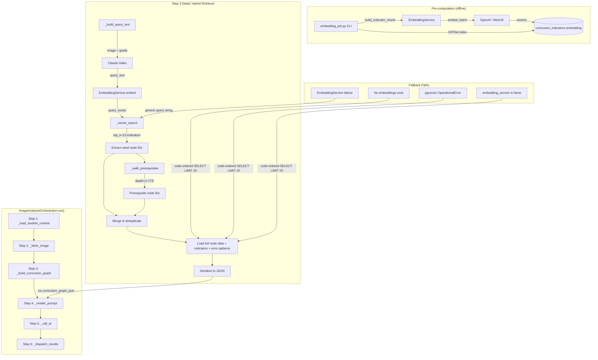

# Design Document — Phase 2: Hybrid RAG Retrieval

## Overview

Phase 2 replaces the brute-force `_build_curriculum_graph` in `ImageAnalysisOrchestrator` with a hybrid retrieval pipeline that combines pgvector cosine similarity search with recursive CTE prerequisite graph traversal. The current implementation dumps up to 100 curriculum nodes (~15–25k tokens) into the AI prompt regardless of relevance. The new pipeline:

1. Generates a brief natural-language description of the student image via a lightweight Claude Haiku call
2. Embeds that description using `EmbeddingService` (OpenAI text-embedding-3-small in prod, all-MiniLM-L6-v2 in dev)
3. Performs cosine similarity search against pre-computed indicator-level embeddings (top_k=15)
4. Walks the prerequisite graph upward from matched nodes via recursive CTE (depth=2)
5. Serializes only the combined 10–20 relevant nodes (~2,500 tokens) into the prompt

Embeddings are pre-computed at the indicator level (not node level) because error patterns on `IndicatorErrorPattern` carry the highest-signal text for semantic matching. A standalone `embedding_job.py` CLI tool handles batch embedding at curriculum import time.

The entire pipeline degrades gracefully: if embeddings are missing, pgvector is unavailable, or the embedding service fails, the orchestrator falls back to the pre-Phase-2 code-ordered SELECT behaviour with clear logging.

## Architecture



### Key Design Decisions

| Decision | Choice | Rationale |
|---|---|---|
| Embed at indicator level | `CurriculumIndicator` not `CurriculumNode` | Error patterns on indicators are highest-signal text for semantic matching |
| top_k=15 | 15 indicators from vector search | Sweet spot: enough coverage without noise; maps to ~10–15 distinct nodes |
| Prerequisite depth=2 | 2 levels of CTE recursion | Covers root-cause level without exploding the node set |
| IVFFlat with lists=100 | Approximate NN index | Sufficient for ~3,600 indicators; exact search too slow at scale |
| Cosine distance | `vector_cosine_ops` | Standard for text embeddings; direction matters more than magnitude |
| Existing `curriculum_prerequisites` table | No new table | `CurriculumPrerequisite` already has `source_node_id` → `target_node_id` edges |
| Indicator chunk format | Deterministic string template | Reproducible embeddings; includes node context + error patterns |
| Fallback to pre-Phase-2 | Code-ordered SELECT LIMIT 20 | Pipeline must never crash due to missing embeddings or pgvector |


## Components and Interfaces

### 1. Alembic Migration: pgvector + Embedding Columns

**File:** `gapsense/alembic/versions/YYYYMMDD_HHMM_<rev>_add_pgvector_embedding_columns.py`

```python
# upgrade()
op.execute("CREATE EXTENSION IF NOT EXISTS vector")
op.add_column("curriculum_indicators",
    sa.Column("embedding", Vector(1536), nullable=True))
op.add_column("curriculum_indicators",
    sa.Column("embedding_model", sa.String(50), nullable=True))

# downgrade()
op.drop_column("curriculum_indicators", "embedding_model")
op.drop_column("curriculum_indicators", "embedding")
# DO NOT drop the vector extension — other tables may use it
```

The migration uses `pgvector.sqlalchemy.Vector` for the column type. The downgrade intentionally does not drop the `vector` extension since other tables may depend on it.

### 2. EmbeddingService

**File:** `gapsense/src/gapsense/ai/embedding_service.py`

```python
class EmbeddingService:
    """Generates vector embeddings from text using a configurable backend.

    Backend is fixed at construction time and never switches during lifetime.
    """

    def __init__(self, settings: Settings) -> None:
        """Construct with backend from settings.EMBEDDING_MODEL.

        Raises ConfigurationError if backend is 'openai' and
        ANTHROPIC_API_KEY / OPENAI_API_KEY is not set.
        """

    async def embed(self, text: str) -> list[float]:
        """Return a single embedding vector for the given text."""

    async def embed_batch(self, texts: list[str]) -> list[list[float]]:
        """Embed multiple texts efficiently.

        OpenAI calls are batched in groups of 100.
        Retries with exponential backoff up to 3 attempts on rate-limit errors.
        """

    @staticmethod
    def build_indicator_chunk(
        node_code: str,
        node_title: str,
        indicator_code: str,
        indicator_title: str,
        error_patterns: list[str],
    ) -> str:
        """Build deterministic indicator chunk text for embedding.

        Format:
            Curriculum node: {node_code} — {node_title}
            Indicator: {indicator_code} — {indicator_title}
            Common errors: {ep1}; {ep2}; {ep3}
        """

    @property
    def model_name(self) -> str:
        """Return canonical model name for the embedding_model column.

        'openai-text-embedding-3-small' or 'minilm-all-MiniLM-L6-v2'
        """

    @property
    def dimensions(self) -> int:
        """Return vector dimensionality: 1536 (OpenAI) or 384 (MiniLM)."""
```

**Settings addition** in `config.py`:

```python
EMBEDDING_MODEL: Literal["openai", "minilm"] = "openai"
OPENAI_API_KEY: str = Field(default="", description="OpenAI API key for embeddings")
```

### 3. Embedding Job

**File:** `gapsense/src/gapsense/jobs/embedding_job.py`

```python
@dataclass
class EmbeddingJobResult:
    country: str
    subject: str
    total_indicators: int
    newly_embedded: int
    already_embedded: int
    errors: int
    duration_seconds: float

async def run_embedding_job(
    country: str,
    subject: str,
    force_refresh: bool = False,
) -> EmbeddingJobResult:
    """Generate and store embeddings for all curriculum indicators.

    Steps:
    1. Validate embedding model consistency (abort if mismatch without force_refresh)
    2. Query indicators where embedding IS NULL (or all if force_refresh)
    3. Build indicator chunks via EmbeddingService.build_indicator_chunk
    4. Call EmbeddingService.embed_batch
    5. Write vectors + model name back to DB
    6. Create IVFFlat index if >= 100 vectors exist (skip if already exists)
    7. Return EmbeddingJobResult summary
    """

# CLI entry point
# python -m gapsense.jobs.embedding_job --country GH --subject mathematics [--force-refresh]
```

**IVFFlat index creation** (inside the job, after embedding):

```sql
CREATE INDEX IF NOT EXISTS idx_curriculum_indicators_embedding
ON curriculum_indicators
USING ivfflat (embedding vector_cosine_ops)
WITH (lists = 100);
```

The job checks `SELECT COUNT(*) FROM curriculum_indicators WHERE embedding IS NOT NULL AND node_id IN (nodes for country/subject)`. If < 100, it skips index creation and logs a warning.

### 4. Orchestrator New Methods

**File:** `gapsense/src/gapsense/services/image_analysis_orchestrator.py`

#### `__init__` (modified)

```python
def __init__(
    self,
    db: Any,
    ai_client: Any,
    media_service: Any,
    guard_service: Any,
    prompt_service: Any,
    worker_service: Any,
    embedding_service: EmbeddingService | None = None,  # NEW
) -> None:
    # ... existing assignments ...
    self._embedding_service = embedding_service
```

#### `_build_query_text`

```python
async def _build_query_text(self, ctx: ImageAnalysisContext) -> str:
    """Generate a 2-3 sentence description of visible math content.

    Uses Claude Haiku with the student image. Includes student grade
    and country for context. Falls back to "{subject} {student_grade}"
    on failure.
    """
```

The prompt sent to Haiku:

```
Describe the mathematical topics and operations visible in this student's
exercise book in 2-3 sentences. Name specific operations (e.g., long division,
fraction addition), number ranges, and any visible error patterns. Do not
diagnose the student. The student is in grade {student_grade} in {country}.
```

#### `_vector_search`

```python
async def _vector_search(
    self,
    query_vector: list[float],
    country: str,
    subject: str,
    top_k: int = 15,
) -> list[CurriculumIndicator]:
    """Cosine similarity search against embedded indicators.

    Returns top_k indicators with their CurriculumNode relationships loaded.
    Falls back to code-ordered SELECT on zero results or OperationalError.
    """
```

SQL equivalent:

```sql
SELECT ci.*, cn.*
FROM curriculum_indicators ci
JOIN curriculum_nodes cn ON ci.node_id = cn.id
WHERE cn.country = :country
  AND cn.subject = :subject
  AND ci.embedding IS NOT NULL
ORDER BY ci.embedding <=> :query_vector
LIMIT :top_k;
```

#### `_walk_prerequisites`

```python
async def _walk_prerequisites(
    self,
    seed_node_ids: set[UUID],
    country: str,
    depth: int = 2,
) -> set[UUID]:
    """Walk prerequisite graph upward from seed nodes via recursive CTE.

    Returns discovered prerequisite node IDs, excluding the seeds themselves.
    Returns empty set if seed_node_ids is empty (no DB query executed).
    """
```

SQL equivalent:

```sql
WITH RECURSIVE prereqs AS (
    -- Base case: direct prerequisites of seed nodes
    SELECT cp.target_node_id AS node_id, 1 AS depth
    FROM curriculum_prerequisites cp
    WHERE cp.source_node_id = ANY(:seed_node_ids)
      AND cp.target_node_id != ALL(:seed_node_ids)

    UNION

    -- Recursive case: walk up one more level
    SELECT cp.target_node_id AS node_id, p.depth + 1
    FROM curriculum_prerequisites cp
    JOIN prereqs p ON cp.source_node_id = p.node_id
    WHERE p.depth < :max_depth
      AND cp.target_node_id != ALL(:seed_node_ids)
)
SELECT DISTINCT node_id FROM prereqs;
```

#### `_build_curriculum_graph` (replaced)

```python
async def _build_curriculum_graph(self, ctx: ImageAnalysisContext) -> None:
    """Hybrid retrieval: vector search + prerequisite walk.

    Pipeline:
    1. _build_query_text → ctx.image_description
    2. EmbeddingService.embed(query_text) → query_vector
    3. _vector_search(query_vector) → indicators → seed_node_ids
    4. _walk_prerequisites(seed_node_ids) → prerequisite_node_ids
    5. Merge seed + prerequisite node IDs (deduplicated)
    6. Load full node data with indicators and error patterns
    7. Serialize to JSON → ctx.curriculum_graph_json
    8. Populate ctx.retrieval_metadata
    9. Log token count

    Falls back to code-ordered SELECT if:
    - self._embedding_service is None
    - Vector search returns zero results
    - Any OperationalError from pgvector
    """
```

#### `_fallback_curriculum_graph`

```python
async def _fallback_curriculum_graph(
    self, ctx: ImageAnalysisContext, reason: str
) -> None:
    """Pre-Phase-2 fallback: code-ordered SELECT LIMIT 20.

    Sets ctx.retrieval_metadata["fallback_reason"] = reason.
    Output is structurally identical to normal retrieval.
    """
```

### 5. ImageAnalysisContext Extensions

**File:** `gapsense/src/gapsense/services/image_analysis_context.py`

Two new fields added to the dataclass:

```python
# ── Resolved in Step 3: build_curriculum_graph (Phase 2) ─────────────
retrieval_metadata: dict[str, Any] = field(default_factory=dict)
image_description: str = ""
```

These fields default to empty values, so existing pipeline steps that don't reference them are unaffected.

### 6. WorkerService Integration

**File:** `gapsense/src/gapsense/services/worker_service.py`

```python
async def _handle_image_analyze(self, task: WorkerTask) -> None:
    from gapsense.ai.embedding_service import EmbeddingService

    # Construct EmbeddingService (None if config missing / not available)
    try:
        embedding_service = EmbeddingService(settings)
    except Exception:
        logger.warning("embedding_service_unavailable", exc_info=True)
        embedding_service = None

    async with AsyncSessionLocal() as db_session:
        orchestrator = ImageAnalysisOrchestrator(
            db=db_session,
            ai_client=self._ai_client,
            media_service=self._media_service,
            guard_service=self._guard_service,
            prompt_service=self._prompt_service,
            worker_service=self,
            embedding_service=embedding_service,  # NEW
        )
        await orchestrator.run(task.payload)
```

### 7. ANALYSIS-001 Template Update

**File:** `gapsense-data/prompts/gapsense_prompt_library_v2.0_multicountry.json`

The user template for ANALYSIS-001 gets retrieval metadata comments inserted above `{{prerequisite_graph_json}}`:

```
<!-- Retrieval: {{total_nodes_injected}} nodes injected -->
<!-- Semantic match: {{seed_node_codes}} -->
<!-- Graph walk: {{prerequisite_node_codes}} -->
<!-- Query: {{query_text_preview}} -->
## PREREQUISITE GRAPH
{{prerequisite_graph_json}}
```

The `_render_prompt` method populates these variables from `ctx.retrieval_metadata`:

```python
extra_context={
    "prerequisite_graph_json": ctx.curriculum_graph_json,
    "total_nodes_injected": ctx.retrieval_metadata.get("total_nodes_injected", 0),
    "seed_node_codes": ", ".join(ctx.retrieval_metadata.get("seed_node_codes", [])),
    "prerequisite_node_codes": ", ".join(ctx.retrieval_metadata.get("prerequisite_node_codes", [])),
    "query_text_preview": ctx.retrieval_metadata.get("query_text_preview", ""),
    # ... existing context ...
}
```


## Data Models

### CurriculumIndicator (modified)

Two new columns added via Alembic migration:

| Column | Type | Nullable | Description |
|---|---|---|---|
| `embedding` | `Vector(1536)` | Yes | Pre-computed embedding vector from `EmbeddingService` |
| `embedding_model` | `String(50)` | Yes | Model that generated the embedding (e.g., `"openai-text-embedding-3-small"`) |

ORM mapping in `curriculum.py`:

```python
from pgvector.sqlalchemy import Vector

class CurriculumIndicator(Base, UUIDPrimaryKeyMixin):
    # ... existing fields ...
    embedding: Mapped[list[float] | None] = mapped_column(Vector(1536), nullable=True)
    embedding_model: Mapped[str | None] = mapped_column(String(50), nullable=True)
```

### IVFFlat Index

```sql
CREATE INDEX idx_curriculum_indicators_embedding
ON curriculum_indicators
USING ivfflat (embedding vector_cosine_ops)
WITH (lists = 100);
```

Created by `embedding_job.py` after embedding a batch, only when >= 100 non-null embeddings exist for the country/subject. The job checks for index existence before creating.

### EmbeddingJobResult (new dataclass)

```python
@dataclass
class EmbeddingJobResult:
    country: str
    subject: str
    total_indicators: int
    newly_embedded: int
    already_embedded: int
    errors: int
    duration_seconds: float
```

### ImageAnalysisContext (extended)

```python
@dataclass
class ImageAnalysisContext:
    # ... existing fields ...

    # ── Resolved in Step 3: build_curriculum_graph (Phase 2) ─────────────
    retrieval_metadata: dict[str, Any] = field(default_factory=dict)
    image_description: str = ""
```

`retrieval_metadata` structure when populated:

```json
{
  "seed_node_ids": ["uuid1", "uuid2", ...],
  "prerequisite_node_ids": ["uuid3", "uuid4", ...],
  "seed_node_codes": ["B4.1.3.1", "B3.1.2.1", ...],
  "prerequisite_node_codes": ["B2.1.3.1", "B1.1.2.2", ...],
  "total_nodes_injected": 14,
  "query_text_preview": "The student is working on multi-digit multiplication with...",
  "fallback_reason": null
}
```

### Indicator Chunk Format

The deterministic text string built per indicator for embedding:

```
Curriculum node: B4.1.3.1 — Fraction Operations
Indicator: B4.1.3.1.2 — Add fractions with unlike denominators
Common errors: Adds numerators and denominators separately; Ignores denominator when adding; Fails to find common denominator
```

This format is enforced by `EmbeddingService.build_indicator_chunk()` and is the sole input to the embedding model. The format includes node-level context (code + title) so the embedding captures both the indicator's specifics and its curriculum position.

### Settings Extensions

```python
class Settings(BaseSettings):
    # ... existing fields ...

    # ── Embedding Configuration (Phase 2) ─────────────────────────────────
    EMBEDDING_MODEL: Literal["openai", "minilm"] = "openai"
    OPENAI_API_KEY: str = Field(default="", description="OpenAI API key for embeddings")
```

### Serialization Format

The JSON output for `ctx.curriculum_graph_json` is structurally identical between normal and fallback modes:

```json
[
  {
    "node_id": "uuid",
    "code": "B4.1.3.1",
    "title": "Fraction Operations",
    "description": "...",
    "indicators": [
      {
        "indicator_code": "B4.1.3.1.2",
        "title": "Add fractions with unlike denominators",
        "error_patterns": [
          {"error_description": "Adds numerators and denominators separately", "severity": "critical"}
        ]
      }
    ]
  }
]
```

This matches the existing serialization format from the current `_build_curriculum_graph`, ensuring downstream pipeline steps (`_render_prompt`, `_call_ai`, `_dispatch_results`) require zero changes.


## Correctness Properties

*A property is a characteristic or behavior that should hold true across all valid executions of a system — essentially, a formal statement about what the system should do. Properties serve as the bridge between human-readable specifications and machine-verifiable correctness guarantees.*

### Property 1: Embedding dimensionality consistency

*For any* text string and any configured backend (OpenAI or MiniLM), calling `embed(text)` SHALL return a list of floats whose length equals the backend's declared dimensionality (1536 for OpenAI, 384 for MiniLM), and calling `embed_batch(texts)` SHALL return a list of the same length as the input, where each element has the correct dimensionality.

**Validates: Requirements 3.1, 3.3, 3.4, 3.8**

### Property 2: Indicator chunk deterministic format

*For any* valid combination of `node_code`, `node_title`, `indicator_code`, `indicator_title`, and `error_patterns` list, `build_indicator_chunk` SHALL return a string matching the format `"Curriculum node: {node_code} — {node_title}\nIndicator: {indicator_code} — {indicator_title}\nCommon errors: {ep1}; {ep2}; ..."` where error patterns are joined by `"; "`. Calling the function twice with the same inputs SHALL produce identical output.

**Validates: Requirements 3.5**

### Property 3: Embedding job idempotency

*For any* country/subject with a set of indicators, running the embedding job twice without `force_refresh` SHALL produce the same database state — the second run SHALL report `newly_embedded=0` and `already_embedded` equal to the first run's `newly_embedded + already_embedded`.

**Validates: Requirements 4.2, 4.5**

### Property 4: Embedding job writes vectors and model name

*For any* indicator processed by the embedding job, after the job completes, the indicator's `embedding` column SHALL be non-null and its `embedding_model` column SHALL equal the `EmbeddingService.model_name` property value.

**Validates: Requirements 4.4, 13.3**

### Property 5: Embedding job force_refresh overwrites

*For any* country/subject with existing embeddings from a previous run, running the embedding job with `force_refresh=True` SHALL overwrite all embeddings, and every indicator's `embedding_model` SHALL match the current `EmbeddingService.model_name` regardless of what model generated the previous embeddings.

**Validates: Requirements 4.6**

### Property 6: Embedding job result accounting

*For any* embedding job run, the returned `EmbeddingJobResult` SHALL satisfy `total_indicators == newly_embedded + already_embedded + errors`.

**Validates: Requirements 4.7**

### Property 7: Embedding model consistency enforcement

*For any* country/subject where existing non-null embeddings have an `embedding_model` value different from the current `EmbeddingService.model_name`, running the embedding job without `force_refresh` SHALL abort with an error and SHALL NOT modify any embeddings.

**Validates: Requirements 4.8, 13.2**

### Property 8: Query text includes context and is stored

*For any* student context with a grade and country, the prompt sent by `_build_query_text` SHALL contain both the student grade string and the country string, and the resulting query text SHALL be stored on `ctx.image_description`.

**Validates: Requirements 5.3, 5.5**

### Property 9: Vector search returns filtered, bounded results

*For any* query vector, country, and subject, `_vector_search` SHALL return at most `top_k` indicators, all of which belong to the specified country and subject and have non-null embeddings, with their `CurriculumNode` relationship loaded.

**Validates: Requirements 6.2, 6.3**

### Property 10: Prerequisite walk returns reachable non-seed nodes

*For any* prerequisite graph and non-empty set of seed node IDs, `_walk_prerequisites` SHALL return only node IDs that are reachable from the seeds via `curriculum_prerequisites` edges within the specified depth, and the returned set SHALL have zero intersection with the seed set.

**Validates: Requirements 7.2, 7.3**

### Property 11: Curriculum graph JSON round-trip

*For any* valid list of node dictionaries produced by the hybrid retrieval pipeline, `json.loads(json.dumps(nodes))` SHALL produce a list of dictionaries equivalent to the original, preserving all node_id, code, title, description, indicators, and error_patterns fields.

**Validates: Requirements 8.6**

### Property 12: Retrieval metadata completeness

*For any* successful hybrid retrieval (non-fallback), `ctx.retrieval_metadata` SHALL contain all required keys: `seed_node_ids` (list of UUID strings), `prerequisite_node_ids` (list of UUID strings), `total_nodes_injected` (integer equal to the number of unique nodes in the JSON), and `query_text_preview` (first 100 characters of the query text).

**Validates: Requirements 8.3**

### Property 13: Fallback structural identity and reason

*For any* fallback activation (embedding_service is None, no embeddings exist, or pgvector OperationalError), the `curriculum_graph_json` output SHALL be valid JSON matching the same schema as normal retrieval output (list of objects with node_id, code, title, description, indicators keys), and `ctx.retrieval_metadata["fallback_reason"]` SHALL be a non-empty string.

**Validates: Requirements 10.3, 12.2, 12.5, 12.6**

### Property 14: Rendered prompt contains retrieval metadata

*For any* `ctx.retrieval_metadata` with populated `total_nodes_injected`, `seed_node_codes`, `prerequisite_node_codes`, and `query_text_preview`, the rendered ANALYSIS-001 prompt SHALL contain each of those values as substrings.

**Validates: Requirements 11.2**

### Property 15: Token count under 4,000 in normal mode

*For any* normal-mode hybrid retrieval with `top_k=15` and `depth=2`, the token count of `ctx.curriculum_graph_json` (measured by a tokenizer compatible with the target AI model) SHALL be less than 4,000 tokens.

**Validates: Requirements 14.2**


## Error Handling

### EmbeddingService Errors

| Error | Handling | Fallback |
|---|---|---|
| OpenAI API key not configured (backend=openai) | Raise `ConfigurationError` at construction time | WorkerService catches, passes `embedding_service=None` to Orchestrator |
| OpenAI rate limit (429) | Exponential backoff, 3 retries | After 3 failures, raise; Orchestrator catches in `_build_curriculum_graph` and falls back |
| OpenAI API error (5xx) | Raise after retry exhaustion | Orchestrator falls back to generic query string, then code-ordered SELECT |
| MiniLM model load failure | Raise at construction time | WorkerService catches, passes `embedding_service=None` |
| Empty text input to `embed()` | Return zero vector or raise `ValueError` | Caller handles; `_build_query_text` ensures non-empty input |

### Orchestrator Fallback Chain

The `_build_curriculum_graph` method implements a cascading fallback:

```
1. Try: _build_query_text (Claude Haiku)
   Fail → Use generic query "{subject} {student_grade}"

2. Try: EmbeddingService.embed(query_text)
   Fail → Use code-ordered SELECT fallback

3. Try: _vector_search(query_vector)
   Zero results → Use code-ordered SELECT fallback
   OperationalError → Use code-ordered SELECT fallback

4. Try: _walk_prerequisites(seed_node_ids)
   Empty seeds → Skip prerequisite walk (no DB query)
   No edges → Return empty set, continue with seed nodes only

5. Always: Serialize nodes to JSON, populate retrieval_metadata
```

Every fallback path:
- Logs the failure with structured fields (error type, country, subject, student_id)
- Sets `ctx.retrieval_metadata["fallback_reason"]` to a descriptive string
- Produces structurally identical JSON output so downstream steps need no conditional logic

### Embedding Job Errors

| Error | Handling |
|---|---|
| Model mismatch (existing embeddings from different model) | Abort with error message instructing `--force-refresh` |
| Database connection failure | Raise; job is CLI-invoked, operator sees the error |
| Partial batch failure (some embeddings fail) | Log failed indicators, continue with remaining; report `errors` count in result |
| IVFFlat index creation failure | Log warning, continue; index is a performance optimization, not required for correctness |

### Token Count Logging

After building the curriculum graph, the orchestrator logs:

```python
logger.info(
    "curriculum_graph_token_count",
    student_id=ctx.student_id,
    token_count=token_count,
    total_nodes=len(nodes),
    fallback_mode=bool(ctx.retrieval_metadata.get("fallback_reason")),
)
```

Token counting uses `tiktoken` with the `cl100k_base` encoding (compatible with Claude's tokenizer for estimation purposes).

## Testing Strategy

### Property-Based Testing

**Library:** `hypothesis` (Python's standard PBT library)

**Configuration:** Minimum 100 examples per property test via `@settings(max_examples=100)`.

Each property test is tagged with a comment referencing the design property:

```python
# Feature: phase2-hybrid-rag-retrieval, Property 1: Embedding dimensionality consistency
```

Property tests to implement:

| Property | Test Description | Key Generators |
|---|---|---|
| 1: Embedding dimensionality | embed/embed_batch returns correct-length vectors | `st.text(min_size=1, max_size=500)`, `st.sampled_from(["openai", "minilm"])` |
| 2: Indicator chunk format | build_indicator_chunk output matches template | `st.text()` for codes/titles, `st.lists(st.text())` for error patterns |
| 3: Job idempotency | Second run reports newly_embedded=0 | Mock DB with pre-seeded indicators |
| 4: Job writes vectors + model | All processed indicators have non-null embedding + correct model | Mock EmbeddingService, in-memory indicator set |
| 5: Force refresh overwrites | After force_refresh, all embedding_model values match current | Mock DB with mixed model names |
| 6: Job result accounting | total == newly + already + errors | `st.integers()` for counts, verify invariant |
| 7: Model consistency enforcement | Mismatch → abort, no modifications | Mock DB with different embedding_model |
| 8: Query text context + storage | Prompt contains grade/country, ctx.image_description set | `st.text()` for grade/country |
| 9: Vector search bounded + filtered | Results ≤ top_k, correct country/subject, non-null embeddings | Mock DB with mixed country/subject indicators |
| 10: Prerequisite walk non-seed | Returned IDs ∩ seed IDs = ∅ | `st.sets(st.uuids())` for seeds, mock graph edges |
| 11: JSON round-trip | loads(dumps(nodes)) == nodes | `st.lists()` of node dicts with `st.text()` fields |
| 12: Retrieval metadata completeness | All required keys present with correct types | Mock retrieval results |
| 13: Fallback structural identity | Fallback JSON matches normal schema, fallback_reason non-empty | Mock various failure scenarios |
| 14: Rendered prompt contains metadata | Metadata values appear as substrings in rendered prompt | `st.text()` for metadata values |
| 15: Token count < 4,000 | Normal-mode JSON under 4k tokens | Mock 15 indicators + depth-2 prerequisites |

### Unit Tests

Unit tests complement property tests for specific examples, edge cases, and integration points:

- **Migration tests**: Verify migration file contains `CREATE EXTENSION IF NOT EXISTS vector`, `Vector(1536)` column, and correct downgrade
- **EmbeddingService construction**: OpenAI backend without API key raises `ConfigurationError`; MiniLM backend constructs without API key
- **Rate limit retry**: Mock 2 rate-limit responses then success → embed returns vector
- **IVFFlat guard**: Mock 50 indicators → index skipped with warning; mock 150 → index created
- **IVFFlat idempotency**: Index already exists → no error
- **_build_query_text fallback**: Mock AI failure → returns `"{subject} {student_grade}"`
- **_vector_search zero results**: No embeddings → falls back to code-ordered SELECT
- **_vector_search OperationalError**: pgvector not installed → falls back to code-ordered SELECT
- **_walk_prerequisites empty seeds**: Empty set → returns empty set, no DB query
- **_walk_prerequisites no edges**: No prerequisite rows → returns empty set with warning
- **Node count > 25 warning**: 30 nodes → warning logged
- **embedding_service=None**: Orchestrator uses fallback mode
- **ANALYSIS-001 template**: Contains retrieval metadata HTML comments
- **ANALYSIS-001 output schema**: Unchanged from Phase 1
- **ImageAnalysisContext defaults**: New fields default to empty dict and empty string
- **Token count logging**: Log message contains student_id, token_count, total_nodes, fallback_mode
- **CLI entry point**: `embedding_job` module is importable and accepts expected arguments

### Test Organization

```
gapsense/tests/
├── unit/
│   ├── test_embedding_service.py        # EmbeddingService unit + property tests
│   ├── test_embedding_job.py            # Embedding job unit + property tests
│   ├── test_hybrid_retrieval.py         # Orchestrator retrieval methods unit + property tests
│   ├── test_image_analysis_context.py   # Context dataclass tests
│   └── test_prompt_retrieval_metadata.py # ANALYSIS-001 template tests
├── integration/
│   └── test_hybrid_pipeline_integration.py  # Full pipeline with test DB
```

### Mocking Strategy

- **EmbeddingService**: Mock for orchestrator tests; use real MiniLM backend for embedding service property tests (fast, no API key needed)
- **Database**: Use SQLAlchemy in-memory SQLite for unit tests; real PostgreSQL + pgvector for integration tests
- **AI Client**: Mock Claude Haiku responses in `_build_query_text` tests
- **OpenAI API**: Mock `httpx` responses for OpenAI embedding tests; test rate-limit retry with mock 429 responses
