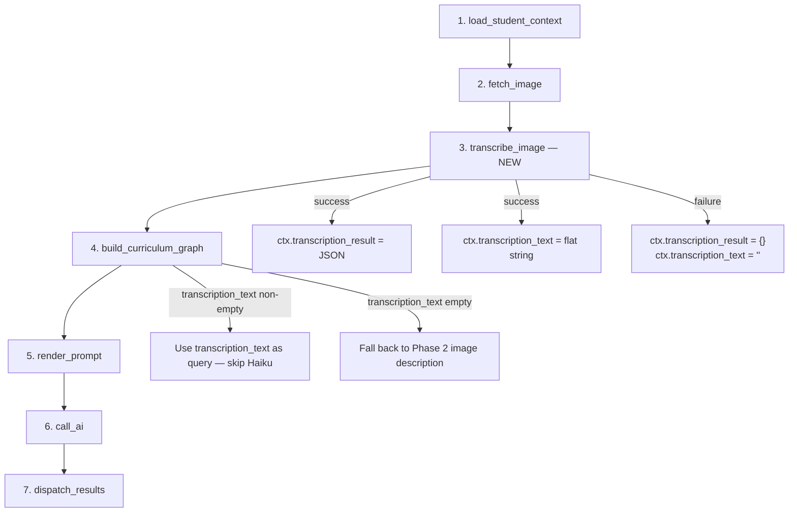
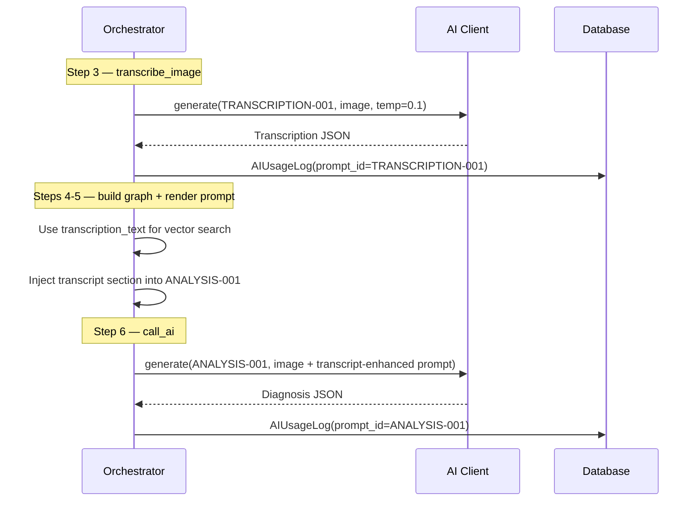

# Design Document — Phase 3: Two-Stage OCR + Diagnosis

## Overview

Phase 3 refactors the GapSense image analysis pipeline from a single-pass approach (image → diagnosis) into a two-stage pipeline (image → transcription → diagnosis). Stage 1 uses a dedicated TRANSCRIPTION-001 prompt with `claude-sonnet-4-6` at low temperature (0.1) to perform pure OCR — extracting structured JSON from student exercise book photos without any diagnostic reasoning. Stage 2 receives this clean transcription alongside the RAG-retrieved curriculum context in the enhanced ANALYSIS-001 prompt, allowing the diagnosis model to reason primarily on text rather than pixels.

The transcription text also replaces the Phase 2 image-description approach for building vector search queries, yielding more accurate curriculum retrieval. The original image is still attached to the Stage 2 call as a fallback for unclear transcript regions.

Key design goals:
- Separation of concerns: OCR is a distinct task from diagnosis
- Graceful degradation: Stage 1 failure must never crash the pipeline; Stage 2 falls back to image-only analysis
- Cost transparency: each AI call gets its own AIUsageLog record with distinct prompt_id
- Schema stability: ANALYSIS-001 output schema and max_tokens remain unchanged

## Architecture

### Pipeline Flow (7 steps)



### Two-Stage AI Call Architecture



### Design Decisions

1. **claude-sonnet-4-6 for Stage 1 (not Haiku)**: OCR accuracy is critical — misread digits cascade into wrong diagnoses. The cost increase is justified by the accuracy gain, and the structured output keeps token count low (max_tokens 2048).

2. **Temperature 0.1 for transcription**: Near-deterministic output is desirable for OCR. We want the model to report what it sees, not be creative.

3. **Separate prompt ID, not a mode flag**: TRANSCRIPTION-001 is a distinct prompt entry in the library rather than a parameter on ANALYSIS-001. This keeps prompts single-purpose and allows independent iteration.

4. **Image still attached to Stage 2**: The transcript is the primary source, but the image serves as fallback for illegible regions and diagram interpretation. This avoids information loss.

5. **Graceful degradation over hard failure**: If Stage 1 fails (network error, malformed JSON, timeout), the pipeline continues with empty transcription fields. Stage 2 still has the image and can operate in the pre-Phase-3 mode.


## Components and Interfaces

### 1. TRANSCRIPTION-001 Prompt (New)

Added to the prompt library JSON at `gapsense-data/prompts/gapsense_prompt_library_v2.0_multicountry.json`.

```json
{
  "TRANSCRIPTION-001": {
    "id": "TRANSCRIPTION-001",
    "name": "Exercise Book OCR Transcription",
    "category": "analysis",
    "version": "1.0.0",
    "status": "active",
    "description": "Pure OCR transcription of student exercise book photos. No diagnosis, no curriculum context.",
    "model": "claude-sonnet-4-6",
    "temperature": 0.1,
    "max_tokens": 2048,
    "system_prompt": "<transcription-only system prompt>",
    "user_template": null
  }
}
```

The system prompt instructs the model to:
1. Orient to page layout (portrait/landscape, columns, margins)
2. Anchor on question numbers
3. Transcribe each question's printed text and student handwriting exactly as written
4. Note handwriting characteristics and illegible regions
5. Preserve original mathematical notation without converting to canonical forms
6. Mark unreadable regions as illegible rather than guessing
7. Return structured JSON (no markdown, no explanation)

No `user_template` is needed — the image is the only input. The system prompt contains the full instruction set and output schema.

### 2. `_transcribe_image` Method (New on Orchestrator)

```python
async def _transcribe_image(self, ctx: ImageAnalysisContext) -> None:
```

Responsibilities:
- Render TRANSCRIPTION-001 prompt via `PromptService.render_prompt`
- Send image to AI client with `model=rendered.model`, `temperature=rendered.temperature`, `max_tokens=rendered.max_tokens`, `json_mode=True`
- Parse JSON response → `ctx.transcription_result`
- Concatenate `question_text` + `student_work` from each question → `ctx.transcription_text`
- On any failure: log warning, set `ctx.transcription_result = {}`, `ctx.transcription_text = ""`, return (no raise)
- Log cost via `_log_ai_cost(ctx, response, prompt_id="TRANSCRIPTION-001")`

### 3. Updated `_build_query_text` (Modified)

Current Phase 2 behavior: calls Claude Haiku to generate an image description, uses that as the vector search query.

New behavior:
```python
def _build_query_text(self, ctx: ImageAnalysisContext) -> str:
    if ctx.transcription_text:
        return ctx.transcription_text  # Skip Haiku call entirely
    # Fall back to Phase 2 image description approach
    ...
```

When `transcription_text` is available, the Haiku image-description call is skipped entirely — saving one AI call and its associated cost/latency.

### 4. `_format_transcript_for_prompt` Helper (New on Orchestrator)

```python
def _format_transcript_for_prompt(self, transcription_result: dict) -> str:
```

Formats the transcription result into a human-readable text block for inclusion in the ANALYSIS-001 user template. Output format:

```
Layout: portrait, single column
Topic: Fractions — addition of unlike fractions
Legibility: mostly_legible

Questions:
  Q1: "Add 1/3 + 1/4"
    Student work: "1/3 + 1/4 = 2/7"
    Teacher mark: ✗
    Illegible regions: none

  Q2: "Simplify 6/8"
    Student work: "6/8 = 3/4"
    Teacher mark: ✓
    Illegible regions: none
```

### 5. Updated `_render_prompt` (Modified)

When `ctx.transcription_result` is non-empty, injects a `transcript_section` key into `extra_context` passed to `PromptService.render_prompt`. The ANALYSIS-001 `user_template` gains a conditional `{{transcript_section}}` placeholder that renders the "STAGE 1 TRANSCRIPTION" block before the prerequisite graph.

When `ctx.transcription_result` is empty, `transcript_section` is set to an empty string, and the template renders without the transcription block (identical to Phase 2 behavior).

### 6. Updated ANALYSIS-001 User Template (Modified)

The `user_template` in the prompt library gains a new section:

```
## STUDENT CONTEXT
...

## STAGE 1 TRANSCRIPTION
{{transcript_section}}

## PREREQUISITE GRAPH
{{prerequisite_graph_json}}

## IMAGE
[Exercise book photo attached]

## TASK
...
```

A new instruction is added to the ANALYSIS-001 system prompt:
> "If a STAGE 1 TRANSCRIPTION section is provided, use it as the primary source of student work. Use the attached image as a fallback for unclear transcript regions or diagram interpretation."

### 7. Updated `_log_ai_cost` (Modified)

```python
async def _log_ai_cost(
    self,
    ctx: ImageAnalysisContext,
    response: Any,
    prompt_id: str | None = None,
) -> None:
```

When `prompt_id` is provided, it overrides `response.prompt_id` in the `AIUsageLog` record. This allows Stage 1 and Stage 2 to log under their respective prompt IDs even if the AI client returns a generic prompt_id.

### 8. Updated `run()` Method (Modified)

The step sequence changes from 6 steps to 7:

```python
await self._load_student_context(ctx)    # Step 1
await self._fetch_image(ctx)             # Step 2
await self._transcribe_image(ctx)        # Step 3 — NEW
await self._build_curriculum_graph(ctx)  # Step 4 (was 3)
await self._render_prompt(ctx)           # Step 5 (was 4)
await self._call_ai(ctx)                # Step 6 (was 5)
await self._dispatch_results(ctx)        # Step 7 (was 6)
```

Step numbering in log messages updates accordingly (`pipeline_step_3_complete` through `pipeline_step_7_complete`).


## Data Models

### ImageAnalysisContext (Modified)

Two new fields added to the dataclass:

```python
@dataclass
class ImageAnalysisContext:
    # ... existing fields ...

    # ── Resolved in Step 3: transcribe_image (NEW) ────────────────────────
    transcription_text: str = ""          # Flat concatenation of question_text + student_work
    transcription_result: dict = field(default_factory=dict)  # Full Stage 1 JSON output
```

Field placement: after `media_type` (Step 2 fields) and before `curriculum_graph_json` (Step 4 fields), matching the pipeline execution order.

### TRANSCRIPTION-001 Output Schema

The structured JSON returned by Stage 1:

```python
TranscriptionResult = {
    "layout": str,                    # e.g. "portrait, single column"
    "subject_detected": str,          # e.g. "mathematics"
    "grade_detected": str,            # e.g. "JHS1" or "unknown"
    "topic_detected": str,            # e.g. "fractions — addition"
    "teacher_marks_present": bool,    # Whether teacher corrections visible
    "questions": [
        {
            "question_number": str,   # e.g. "1", "2a"
            "question_text": str,     # Printed question text
            "student_work": str,      # Student's handwritten answer
            "teacher_mark": str,      # "✓", "✗", "½", or ""
            "teacher_score": str,     # e.g. "2/5" or ""
            "has_diagram": bool,      # Whether question includes a diagram
            "illegible_regions": str,  # Description of unreadable areas, or ""
        }
    ],
    "overall_legibility": str,        # "legible", "mostly_legible", "partially_legible", "poor"
    "handwriting_styles_detected": str,  # e.g. "print, cursive mix"
    "ocr_notes": str,                 # Free-text notes about transcription challenges
}
```

### Transcription Text Construction

`ctx.transcription_text` is built by concatenating question fields:

```python
parts = []
for q in transcription_result.get("questions", []):
    text = q.get("question_text", "").strip()
    work = q.get("student_work", "").strip()
    if text:
        parts.append(text)
    if work:
        parts.append(work)
ctx.transcription_text = " ".join(parts)
```

This produces a flat string suitable for embedding-based vector search — no formatting, no metadata, just the mathematical content.

### ANALYSIS-001 Output Schema (Unchanged)

The Stage 2 output schema remains identical to Phase 1:

```json
{
  "image_quality": "clear|partially_readable|poor",
  "problems_extracted": [...],
  "overall_pattern": "string",
  "gap_node_ids": ["..."],
  "suspected_gaps": ["..."],
  "recommended_diagnostic_path": "string",
  "language_barrier_detected": "boolean",
  "confidence": "number 0-1"
}
```

No fields added, removed, or modified. No max_tokens increase.

### AIUsageLog (Unchanged Schema)

The `AIUsageLog` table schema is unchanged. The `prompt_id` column already supports arbitrary string values. Phase 3 simply ensures that Stage 1 logs write `prompt_id="TRANSCRIPTION-001"` and Stage 2 logs write `prompt_id="ANALYSIS-001"`.

### Cost Calculator (Modified)

The `ANTHROPIC_PRICING` dict in `cost_calculator.py` needs a new entry for `claude-sonnet-4-6` if not already present, to ensure Stage 1 costs are calculated correctly.


## Correctness Properties

*A property is a characteristic or behavior that should hold true across all valid executions of a system — essentially, a formal statement about what the system should do. Properties serve as the bridge between human-readable specifications and machine-verifiable correctness guarantees.*

### Property 1: Transcription text concatenation preserves all content

*For any* valid transcription result containing a list of questions, each with `question_text` and `student_work` fields, the resulting `transcription_text` string shall contain every non-empty `question_text` and every non-empty `student_work` value from the input, and the length of the concatenated parts shall equal the number of non-empty text fragments.

**Validates: Requirements 2.4**

### Property 2: Stage 1 failure never crashes the pipeline

*For any* failure mode during `_transcribe_image` (invalid JSON response, network error, timeout, malformed data, None response), the method shall set `ctx.transcription_result` to an empty dict and `ctx.transcription_text` to an empty string, and shall not raise an exception.

**Validates: Requirements 2.5, 2.6**

### Property 3: Query text prefers transcription over image description

*For any* `ImageAnalysisContext` where `transcription_text` is a non-empty string, `_build_query_text` shall return a value derived from `transcription_text` without invoking the Claude Haiku image description call. Conversely, when `transcription_text` is empty, the method shall fall back to the Phase 2 image description approach.

**Validates: Requirements 4.1, 4.3**

### Property 4: Transcript formatting includes all required fields

*For any* non-empty transcription result containing `layout`, `topic_detected`, `overall_legibility`, and a list of questions (each with `question_number`, `question_text`, and `student_work`), the output of `_format_transcript_for_prompt` shall contain every non-empty `layout`, `topic_detected`, `overall_legibility` value, and for each question, the `question_number`, non-empty `question_text`, and non-empty `student_work`.

**Validates: Requirements 5.1, 5.2, 5.4**

### Property 5: Cost logging respects prompt_id override

*For any* AI response and any `prompt_id` string passed to `_log_ai_cost`, the resulting `AIUsageLog` record shall have its `prompt_id` field set to the provided override value (not the response's default prompt_id), and the `total_cost_usd` shall equal the sum of `input_cost_usd` and `output_cost_usd` as computed by the cost calculator for the response's model and token counts.

**Validates: Requirements 7.3, 7.4, 7.5**


## Error Handling

### Stage 1 Failure Modes

| Failure | Cause | Handling |
|---------|-------|----------|
| AI client returns `None` | Network timeout, rate limit, provider outage | Log warning, set empty defaults, continue pipeline |
| AI response has no `json_parsed` | Model returned non-JSON text | Log warning, set empty defaults, continue pipeline |
| JSON missing expected keys | Model hallucinated different schema | Log warning, use partial result where possible, set missing fields to defaults |
| `json.JSONDecodeError` during parsing | Malformed JSON in response | Log warning, set empty defaults, continue pipeline |
| Unexpected exception | Bug in transcription logic | Catch broad `Exception`, log error with traceback, set empty defaults, continue pipeline |

All failure paths converge to the same outcome: `ctx.transcription_result = {}`, `ctx.transcription_text = ""`, pipeline continues. This is enforced by a `try/except Exception` block wrapping the entire `_transcribe_image` method body.

### Stage 1 Cost Logging Failure

If `_log_ai_cost` fails for the Stage 1 call (e.g., DB connection error), the existing error handling in `_log_ai_cost` catches the exception, logs it, rolls back the transaction, and continues. The transcription result is still available for downstream steps.

### Downstream Impact of Stage 1 Failure

When Stage 1 fails:
- `_build_query_text` falls back to Phase 2 image description (Haiku call)
- `_render_prompt` renders ANALYSIS-001 without the "STAGE 1 TRANSCRIPTION" section
- `_call_ai` sends image-only to Stage 2 (pre-Phase-3 behavior)
- Net effect: the pipeline degrades gracefully to Phase 2 behavior

### Stage 2 Failure Modes

Stage 2 error handling is unchanged from Phase 1/2. The existing `_call_ai` and `_dispatch_results` methods handle AI failures and missing results.

## Testing Strategy

### Property-Based Testing

Library: **Hypothesis** (Python's standard PBT library, already used in the project)

Each property test runs a minimum of 100 iterations with generated inputs.

Each test is tagged with a comment referencing the design property:
```python
# Feature: phase3-two-stage-ocr-diagnosis, Property 1: Transcription text concatenation preserves all content
```

#### Property Test 1: Transcription Text Concatenation
- Generate random lists of question dicts with arbitrary `question_text` and `student_work` strings
- Call the concatenation logic
- Assert every non-empty input fragment appears in the output
- Assert the output contains no extra content beyond the input fragments and joining spaces
- **Feature: phase3-two-stage-ocr-diagnosis, Property 1: Transcription text concatenation preserves all content**

#### Property Test 2: Stage 1 Failure Graceful Degradation
- Generate random failure scenarios: None responses, responses with `json_parsed=None`, responses with malformed JSON, exceptions during parsing
- Call `_transcribe_image` with mocked AI client returning each failure
- Assert `ctx.transcription_result == {}` and `ctx.transcription_text == ""` after each call
- Assert no exception propagates
- **Feature: phase3-two-stage-ocr-diagnosis, Property 2: Stage 1 failure never crashes the pipeline**

#### Property Test 3: Query Text Prefers Transcription
- Generate random non-empty strings for `transcription_text`
- Call `_build_query_text` with the context
- Assert the return value uses the transcription text
- Assert the Haiku image description method was not called (mock verification)
- **Feature: phase3-two-stage-ocr-diagnosis, Property 3: Query text prefers transcription over image description**

#### Property Test 4: Transcript Formatting Completeness
- Generate random transcription results with varying numbers of questions, each with random field values
- Call `_format_transcript_for_prompt`
- Assert the output contains every non-empty `layout`, `topic_detected`, `overall_legibility`, and per-question `question_number`, `question_text`, `student_work`
- **Feature: phase3-two-stage-ocr-diagnosis, Property 4: Transcript formatting includes all required fields**

#### Property Test 5: Cost Logging Prompt ID Override
- Generate random prompt_id strings and mock AI responses with random token counts
- Call `_log_ai_cost` with the override prompt_id
- Assert the created AIUsageLog has the override prompt_id
- Assert total_cost_usd == input_cost_usd + output_cost_usd
- **Feature: phase3-two-stage-ocr-diagnosis, Property 5: Cost logging respects prompt_id override**

### Unit Tests (Examples and Edge Cases)

Unit tests cover specific examples, integration points, and edge cases that complement the property tests:

1. **TRANSCRIPTION-001 prompt registration**: Verify `PromptService` can render TRANSCRIPTION-001 without error, and the rendered prompt has `model="claude-sonnet-4-6"`, `temperature=0.1`, `max_tokens=2048`
2. **ImageAnalysisContext defaults**: Verify a fresh context has `transcription_text=""` and `transcription_result={}`
3. **Pipeline step order**: Mock all steps, run the pipeline, assert call order is `[load_student_context, fetch_image, transcribe_image, build_curriculum_graph, render_prompt, call_ai, dispatch_results]`
4. **Transcript section in rendered prompt**: With a non-empty transcription result, verify the rendered ANALYSIS-001 prompt contains "STAGE 1 TRANSCRIPTION"
5. **No transcript section when empty**: With empty transcription result, verify the rendered ANALYSIS-001 prompt does not contain "STAGE 1 TRANSCRIPTION"
6. **Image still attached to Stage 2**: Verify `_call_ai` sends the image alongside the transcript-enhanced prompt
7. **Dual cost logging**: Run full pipeline with mocked AI, verify two AIUsageLog records created with distinct prompt_ids
8. **ANALYSIS-001 schema unchanged**: Verify the `output_schema` key in the prompt library for ANALYSIS-001 matches the Phase 1 schema exactly
9. **ANALYSIS-001 max_tokens unchanged**: Verify `max_tokens` for ANALYSIS-001 has not increased
10. **Empty questions list**: Verify concatenation of an empty questions array produces `transcription_text=""`
11. **Query fallback on empty transcription**: With `transcription_text=""`, verify `_build_query_text` invokes the Haiku image description path
