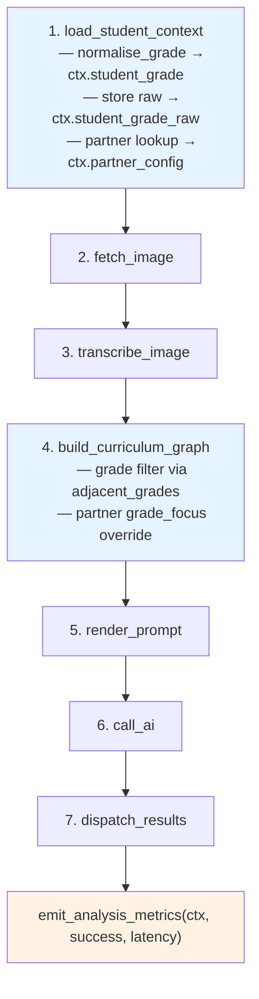
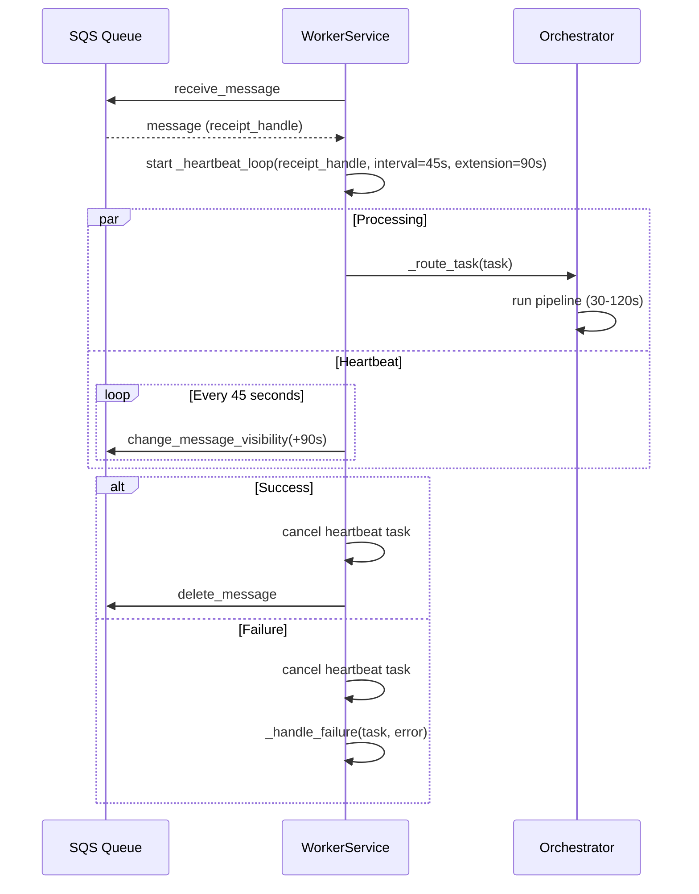
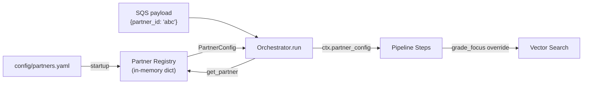

# Design Document — Phase 4: Grade Normalisation + Ongoing Hardening

## Overview

Phase 4 introduces two independent streams of work that complete the GapSense improvement plan. Stream A (Grade Normalisation, Requirements 1–8) adds a centralised `grade_utils` module that maps display-grade strings from four countries (Ghana, Uganda, Kenya, Nigeria) to canonical grade codes, integrates normalisation into the orchestrator pipeline, filters vector search by adjacent grades, and persists canonical grades on the Student model. Stream B (Operational Hardening, Requirements 9–14) adds SQS visibility-timeout heartbeats to prevent message redelivery during long analyses, structured metrics logging, a YAML-based partner configuration registry, partner injection into the pipeline, and multi-country support in `country_utils`.

Key design goals:
- Grade normalisation is additive — `current_grade` is preserved, `grade_canonical` is added
- Normalisation failure is non-fatal — fallback to raw grade with a warning, no grade filter applied
- Partner config from YAML (not database) — simpler for MVP, migrate to DB when partner count exceeds ~5
- Metrics are structured log events only — no external API calls in the hot path
- Heartbeat failure is non-fatal — the existing idempotency guard handles redelivery
- `adjacent_grades(radius=1)` for vector search — avoids over-filtering while improving relevance
- Stream A (data/accuracy) should complete before Stream B (ops)

## Architecture

### Modified Pipeline Flow (7 steps + cross-cutting concerns)



Steps modified by Phase 4 are highlighted. Step 1 gains grade normalisation and partner config lookup. Step 4 gains grade-filtered vector search. A new post-pipeline hook emits structured metrics.

### SQS Heartbeat Architecture



### Partner Config Flow



### Design Decisions

| Decision | Choice | Rationale |
|----------|--------|-----------|
| Grade storage | Additive `grade_canonical` column | Non-breaking; `current_grade` remains source of truth for display |
| Normalisation failure | Fallback to raw grade, log warning | Pipeline must never crash due to unmapped grade |
| Grade filter radius | `radius=1` (±1 adjacent grades) | Balances relevance vs. recall; configurable per-partner later |
| Partner config source | YAML file, not database | Simpler for MVP (<5 partners); avoids migration complexity |
| Metrics transport | Structured logging only | No external API calls in hot path; CloudWatch/Datadog ingest from logs |
| Heartbeat failure | Non-fatal, log warning | Idempotency guard already handles redelivery |
| Country resolution | School → payload fallback → "ghana" | Progressive resolution; removes hardcoded default |

## Components and Interfaces

### Stream A: Grade Normalisation

#### 1. `gapsense/core/grade_utils.py` (NEW)

```python
"""Canonical grade mapping, normalisation, and adjacency functions."""

# Type: dict[country_key, dict[display_grade_lower, canonical_grade]]
GRADE_MAPS: dict[str, dict[str, str]]

# Ordered canonical grades per country
GRADE_SEQUENCES: dict[str, list[str]]

def normalise_grade(grade: str, country: str) -> str | None:
    """Return canonical grade for a display grade + country.

    Case-insensitive lookup against GRADE_MAPS[country].
    Returns None if no match found.
    """

def grade_range_for_country(country: str) -> list[str]:
    """Return all canonical grades for a country in ascending educational order."""

def adjacent_grades(grade: str, country: str, radius: int = 1) -> list[str]:
    """Return canonical grades within ±radius of the given grade.

    Clamps at sequence boundaries without error.
    """
```

#### 2. `ImageAnalysisContext` changes

```python
@dataclass
class ImageAnalysisContext:
    # ... existing fields ...

    # Phase 4 additions
    student_grade_raw: str = ""          # original student.current_grade
    partner_config: PartnerConfig | None = None  # from partner registry lookup
```

#### 3. `ImageAnalysisOrchestrator._load_student_context` changes

```python
async def _load_student_context(self, ctx: ImageAnalysisContext) -> None:
    # ... existing student load ...

    ctx.student_grade_raw = student.current_grade
    canonical = normalise_grade(student.current_grade, ctx.country_key)
    if canonical is None:
        logger.warning(
            "grade_normalisation_failed",
            raw_grade=student.current_grade,
            country=ctx.country_key,
        )
        ctx.student_grade = student.current_grade  # fallback
    else:
        ctx.student_grade = canonical
```

#### 4. `_build_curriculum_graph` grade filter

The existing `_build_curriculum_graph` method gains an optional grade filter. When `ctx.student_grade` is a valid canonical grade, the query adds a `WHERE grade IN (...)` clause using `adjacent_grades(grade, country, radius=1)`. Partner `grade_focus` overrides the student grade when present.

```python
async def _build_curriculum_graph(self, ctx: ImageAnalysisContext) -> None:
    # Determine effective grade for filtering
    effective_grade = ctx.student_grade
    if ctx.partner_config and ctx.partner_config.grade_focus:
        effective_grade = ctx.partner_config.grade_focus

    # Compute allowed grades
    allowed_grades = None
    if effective_grade:
        from gapsense.core.grade_utils import adjacent_grades
        allowed = adjacent_grades(effective_grade, ctx.country_key, radius=1)
        if allowed:
            allowed_grades = allowed

    # Build query with optional grade filter
    query = (
        select(CurriculumNode)
        .where(
            CurriculumNode.country == ctx.country_key,
            CurriculumNode.subject == ctx.subject,
        )
    )
    if allowed_grades:
        query = query.where(CurriculumNode.grade.in_(allowed_grades))

    # ... rest of existing method unchanged ...
```

#### 5. `Student` model — `grade_canonical` column

```python
class Student(Base, UUIDPrimaryKeyMixin, TimestampMixin):
    # ... existing columns ...

    grade_canonical: Mapped[str | None] = mapped_column(
        String(16),
        nullable=True,
        comment="Normalised canonical grade code (e.g., 'B7' for JHS1 in Ghana)",
    )
```

#### 6. Alembic migration

A single migration file that:
1. Adds `grade_canonical` column (nullable `String(16)`) to `students` table
2. Runs a data migration using `normalise_grade` to backfill existing rows
3. Uses `op.execute()` with raw SQL for the backfill to avoid ORM dependency in migrations

### Stream B: Operational Hardening

#### 7. `WorkerService` heartbeat methods

```python
class WorkerService:
    async def _extend_visibility_timeout(
        self, receipt_handle: str, extension_seconds: int = 60
    ) -> None:
        """Call SQS ChangeMessageVisibility API."""

    async def _heartbeat_loop(
        self, receipt_handle: str, interval: int = 45, extension: int = 90
    ) -> None:
        """Periodically extend visibility timeout.

        Runs as a concurrent asyncio.Task. On CancelledError, exits cleanly.
        On SQS errors, logs warning and continues.
        """

    async def _process_message_with_heartbeat(self, msg: dict[str, Any]) -> None:
        """Wraps _process_message with heartbeat lifecycle."""
```

#### 8. `gapsense/core/metrics.py` (NEW)

```python
"""Structured analysis metrics emitter."""

def emit_analysis_metrics(
    ctx: ImageAnalysisContext, success: bool, latency_ms: float
) -> None:
    """Emit a single structured log event with analysis metrics.

    Fields: student_id, country, subject, grade, success, latency_ms,
    nodes_injected, seed_nodes, prerequisite_nodes, transcription_legibility,
    questions_transcribed, gaps_found, ai_confidence.

    No external API calls — structured logging only.
    """
```

#### 9. `gapsense/core/partner_config.py` (NEW)

```python
"""Partner configuration dataclass and YAML registry."""

from dataclasses import dataclass

@dataclass(frozen=True)
class PartnerConfig:
    partner_id: str
    country: str
    subject_focus: str | None = None
    grade_focus: str | None = None
    rate_limit_per_day: int = 1000
    whatsapp_sender_id: str = ""
    report_language: str = "en"
```

#### 10. `gapsense/core/partner_registry.py` (NEW)

```python
"""YAML-based partner registry loaded at startup."""

_registry: dict[str, PartnerConfig] = {}

def load_partner_registry(yaml_path: str = "config/partners.yaml") -> None:
    """Parse YAML and construct PartnerConfig instances.

    Raises on missing file or invalid entries.
    Logs warning for entries missing required fields (skips them).
    """

def get_partner(partner_id: str) -> PartnerConfig | None:
    """Retrieve a partner config by ID. Returns None if not found."""
```

#### 11. `country_utils.py` changes

```python
def get_country_from_student(
    student: Student | None,
    fallback_country: str = "ghana",
) -> str:
    """Derive country from student's school, then fallback_country.

    Resolution order:
    1. student.school.district.region.country (if relationship chain exists)
    2. fallback_country parameter (from task payload)
    3. "ghana" (default parameter value)
    """
```

### `config/partners.yaml` schema

```yaml
partners:
  - partner_id: "rising-academy"
    country: "ghana"
    subject_focus: null
    grade_focus: null
    rate_limit_per_day: 5000
    whatsapp_sender_id: "+233XXXXXXXXX"
    report_language: "en"

  - partner_id: "bridge-uganda"
    country: "uganda"
    subject_focus: "mathematics"
    grade_focus: "P3"
    rate_limit_per_day: 2000
    whatsapp_sender_id: "+256XXXXXXXXX"
    report_language: "en"
```

## Data Models

### Grade Maps

#### Ghana (`country_key = "ghana"`)

| Display Grade | Canonical Grade | Notes |
|---------------|----------------|-------|
| B1–B9 | B1–B9 | Identity mapping |
| Primary 1–6 | B1–B6 | Long-form primary |
| JHS1–JHS3 | B7–B9 | Junior High School |
| JHS 1–JHS 3 | B7–B9 | With space variant |

Ordered sequence: `["B1", "B2", "B3", "B4", "B5", "B6", "B7", "B8", "B9"]`

#### Uganda (`country_key = "uganda"`)

| Display Grade | Canonical Grade | Notes |
|---------------|----------------|-------|
| P1–P7 | P1–P7 | Identity mapping |
| Primary 1–7 | P1–P7 | Long-form primary |
| S1–S4 | S1–S4 | Identity mapping |
| Senior 1–4 | S1–S4 | Long-form secondary |

Ordered sequence: `["P1", "P2", "P3", "P4", "P5", "P6", "P7", "S1", "S2", "S3", "S4"]`

#### Kenya (`country_key = "kenya"`)

| Display Grade | Canonical Grade | Notes |
|---------------|----------------|-------|
| G1–G9 | G1–G9 | Identity mapping |
| Grade 1–9 | G1–G9 | Long-form |
| Standard 1–6 | G1–G6 | Old naming convention |

Ordered sequence: `["G1", "G2", "G3", "G4", "G5", "G6", "G7", "G8", "G9"]`

#### Nigeria (`country_key = "nigeria"`)

| Display Grade | Canonical Grade | Notes |
|---------------|----------------|-------|
| P1–P6 | P1–P6 | Identity mapping |
| Primary 1–6 | P1–P6 | Long-form primary |
| JSS1–JSS3 | JSS1–JSS3 | Identity mapping |
| JSS 1–JSS 3 | JSS1–JSS3 | With space variant |

Ordered sequence: `["P1", "P2", "P3", "P4", "P5", "P6", "JSS1", "JSS2", "JSS3"]`

### Database Changes

#### `students` table — new column

| Column | Type | Nullable | Default | Index |
|--------|------|----------|---------|-------|
| `grade_canonical` | `String(16)` | Yes | `NULL` | `idx_students_grade_canonical` |

### PartnerConfig dataclass fields

| Field | Type | Required | Default | Description |
|-------|------|----------|---------|-------------|
| `partner_id` | `str` | Yes | — | Unique partner identifier |
| `country` | `str` | Yes | — | Country key (e.g., "ghana") |
| `subject_focus` | `str \| None` | No | `None` | Subject filter override |
| `grade_focus` | `str \| None` | No | `None` | Grade filter override for vector search |
| `rate_limit_per_day` | `int` | No | `1000` | Max analyses per day |
| `whatsapp_sender_id` | `str` | No | `""` | WhatsApp sender phone |
| `report_language` | `str` | No | `"en"` | Report language code |

### Metrics Event Schema

The `analysis_metrics` structured log event contains:

| Field | Source | Type |
|-------|--------|------|
| `student_id` | `ctx.student_id` | `str` |
| `country` | `ctx.country_key` | `str` |
| `subject` | `ctx.subject` | `str` |
| `grade` | `ctx.student_grade` | `str` |
| `success` | parameter | `bool` |
| `latency_ms` | parameter | `float` |
| `nodes_injected` | parsed from `ctx.curriculum_graph_json` | `int` |
| `seed_nodes` | from `ctx.retrieval_metadata` | `int` |
| `prerequisite_nodes` | from `ctx.retrieval_metadata` | `int` |
| `transcription_legibility` | from `ctx.transcription_result` | `str \| None` |
| `questions_transcribed` | from `ctx.transcription_result` | `int` |
| `gaps_found` | from `ctx.ai_response` | `int` |
| `ai_confidence` | from `ctx.ai_response` | `float \| None` |

## Correctness Properties

*A property is a characteristic or behavior that should hold true across all valid executions of a system — essentially, a formal statement about what the system should do. Properties serve as the bridge between human-readable specifications and machine-verifiable correctness guarantees.*

### Property 1: Canonical grade round-trip (idempotency)

*For any* country in GRADE_MAPS and *for any* canonical grade in that country's ordered sequence, `normalise_grade(canonical_grade, country)` should return the same canonical grade.

**Validates: Requirements 1.8**

### Property 2: Case-insensitive normalisation

*For any* country in GRADE_MAPS and *for any* valid display grade for that country, `normalise_grade(display_grade.upper(), country)` and `normalise_grade(display_grade.lower(), country)` and `normalise_grade(display_grade, country)` should all return the same canonical grade.

**Validates: Requirements 1.2, 1.3**

### Property 3: Unrecognised grades return None

*For any* string that is not a key in any country's grade map (after case-folding), `normalise_grade(string, country)` should return `None`.

**Validates: Requirements 1.4**

### Property 4: Adjacent grades are within radius bounds

*For any* country, *for any* canonical grade in that country's sequence, and *for any* radius ≥ 0, every grade returned by `adjacent_grades(grade, country, radius)` should be at most `radius` positions away from the input grade in the country's ordered sequence, and the input grade itself should always be included.

**Validates: Requirements 1.6, 1.7**

### Property 5: Adjacent grades boundary clamping

*For any* country and *for any* canonical grade at position `i` in the country's sequence of length `n`, `adjacent_grades(grade, country, radius)` should return exactly `min(i + radius, n - 1) - max(i - radius, 0) + 1` grades (i.e., clamped at boundaries, no error raised).

**Validates: Requirements 1.6, 1.7**

### Property 6: Student context preserves raw grade and normalises

*For any* Student with a `current_grade` and a resolved `country_key`, after `_load_student_context` executes, `ctx.student_grade_raw` should equal `student.current_grade`, and `ctx.student_grade` should equal either `normalise_grade(current_grade, country)` (when non-None) or `current_grade` (as fallback).

**Validates: Requirements 6.1, 6.2, 6.4**

### Property 7: Grade-filtered vector search returns only adjacent-grade nodes

*For any* valid canonical grade and country, all curriculum nodes returned by the grade-filtered vector search should have a `grade` value that is in the set returned by `adjacent_grades(grade, country, radius=1)`.

**Validates: Requirements 7.2**

### Property 8: Partner grade_focus overrides student grade in vector search

*For any* PartnerConfig with a non-null `grade_focus` and *for any* student grade, the effective grade used for vector search filtering should be the partner's `grade_focus`, not the student's canonical grade.

**Validates: Requirements 7.4, 13.3**

### Property 9: Student grade_canonical consistency

*For any* Student record with a `current_grade` and a known country, `grade_canonical` should equal `normalise_grade(current_grade, country)`. This should hold after creation and after any update to `current_grade`.

**Validates: Requirements 8.2, 8.3**

### Property 10: Heartbeat cancellation on all outcomes

*For any* message processed by the worker (whether the task succeeds or fails with an exception), the heartbeat loop task should be cancelled after `_process_message` returns.

**Validates: Requirements 9.4**

### Property 11: Metrics event contains all required fields

*For any* ImageAnalysisContext (with varying combinations of populated/empty fields), calling `emit_analysis_metrics(ctx, success, latency_ms)` should produce a structured log event containing all 13 required fields: student_id, country, subject, grade, success, latency_ms, nodes_injected, seed_nodes, prerequisite_nodes, transcription_legibility, questions_transcribed, gaps_found, and ai_confidence.

**Validates: Requirements 10.3**

### Property 12: Partner registry round-trip

*For any* valid YAML partner entry with all required fields, after loading the registry, `get_partner(partner_id)` should return a `PartnerConfig` whose fields match the YAML entry values.

**Validates: Requirements 12.2, 12.3**

### Property 13: Country resolution progressive fallback

*For any* Student, `get_country_from_student(student, fallback_country)` should return: (a) the school's country if the student has a school with a country association, or (b) `fallback_country` if no school country is available. The function should never return the hardcoded "ghana" when a different `fallback_country` is provided.

**Validates: Requirements 14.1, 14.2, 14.3**

## Error Handling

### Grade Normalisation Errors

| Scenario | Behaviour | Severity |
|----------|-----------|----------|
| Unknown display grade for country | `normalise_grade` returns `None`; orchestrator falls back to raw grade, logs warning | Warning |
| Unknown country key in `normalise_grade` | Returns `None` (country not in GRADE_MAPS) | Warning |
| Unknown country key in `grade_range_for_country` | Returns empty list | Warning |
| Unknown country key in `adjacent_grades` | Returns empty list (no grades to filter by) | Warning |
| Grade at sequence boundary in `adjacent_grades` | Clamps to available range, no error | Normal |

### SQS Heartbeat Errors

| Scenario | Behaviour | Severity |
|----------|-----------|----------|
| `ChangeMessageVisibility` API fails | Log warning, continue processing; idempotency guard handles redelivery | Warning |
| Heartbeat loop cancelled (task complete) | Exit cleanly via `asyncio.CancelledError`, no error log | Normal |
| Receipt handle expired | Log warning, continue; message may be redelivered but idempotency guard handles it | Warning |

### Partner Configuration Errors

| Scenario | Behaviour | Severity |
|----------|-----------|----------|
| `config/partners.yaml` missing at startup | Raise exception, prevent startup | Fatal |
| YAML parse error | Raise exception, prevent startup | Fatal |
| Partner entry missing required fields | Log warning with partner_id and missing fields, skip entry | Warning |
| `partner_id` in payload not found in registry | `get_partner` returns `None`; pipeline proceeds with defaults | Normal |
| Duplicate `partner_id` in YAML | Last entry wins; log warning | Warning |

### Country Resolution Errors

| Scenario | Behaviour | Severity |
|----------|-----------|----------|
| Student has no school | Fall back to `fallback_country` parameter | Normal |
| School has no country association | Fall back to `fallback_country` parameter | Normal |
| `fallback_country` not in `_COUNTRY_DEFAULTS` | Return the raw fallback string (lowercase) | Warning |

### Metrics Errors

| Scenario | Behaviour | Severity |
|----------|-----------|----------|
| Context fields missing/None | Emit metric with `None`/default values for missing fields | Normal |
| Structured logging fails | Catch exception, log to stderr, do not crash pipeline | Warning |

## Testing Strategy

### Property-Based Testing

Property-based tests use **Hypothesis** (Python's standard PBT library) with a minimum of 100 iterations per property. Each test references its design property with a comment tag.

Tag format: `# Feature: phase4-grade-normalisation-hardening, Property {N}: {title}`

Each correctness property (Properties 1–13) maps to a single Hypothesis test. Generators will produce:

- Random country keys from the supported set
- Random display grades from GRADE_MAPS (for valid inputs)
- Random strings not in any grade map (for invalid inputs)
- Random case variations of valid display grades
- Random radii (0–20) for adjacency tests
- Random PartnerConfig instances with varying grade_focus values
- Random ImageAnalysisContext instances with varying field populations
- Random Student instances with varying current_grade and school associations

### Unit Tests (Examples and Edge Cases)

Unit tests cover specific examples from Requirements 2–5 (country-specific grade maps), structural requirements, and integration points:

**Grade Maps (Req 2–5):**
- Each country's specific display-grade → canonical-grade mappings (2.1–2.5, 3.1–3.5, 4.1–4.4, 5.1–5.5)
- `grade_range_for_country` returns exact expected sequences (1.5, 2.5, 3.5, 4.4, 5.5)

**Orchestrator Integration (Req 6):**
- Warning logged when normalise_grade returns None (6.3)
- `student_grade_raw` field exists with default empty string (6.5)

**Vector Search (Req 7):**
- No grade filter when grade is None (7.3)
- Grade filter interface accepts optional grade parameter (7.1)

**Student Model (Req 8):**
- `grade_canonical` column exists, nullable, String(16) (8.1)

**Heartbeat (Req 9):**
- `_extend_visibility_timeout` calls SQS API (9.1)
- `_heartbeat_loop` calls extend at interval (9.2)
- Heartbeat started on message processing (9.3)
- Heartbeat error logs warning, doesn't raise (9.5)
- Heartbeat cancellation exits cleanly (9.6)

**Metrics (Req 10):**
- `emit_analysis_metrics` function signature (10.1)
- Log event named "analysis_metrics" (10.2)
- Pipeline calls metrics on success and failure (10.4)

**Partner Config (Req 11–13):**
- PartnerConfig dataclass fields (11.1)
- Registry loads from YAML path (12.1)
- Missing YAML raises at startup (12.4)
- Missing required fields logs warning, skips entry (12.5)
- Orchestrator looks up partner from payload (13.1)
- PartnerConfig stored in context (13.2)
- No partner proceeds with defaults (13.4)
- Context has partner_config field defaulting to None (13.5)

**Country Utils (Req 14):**
- `fallback_country` parameter accepted (14.3)
- `_COUNTRY_DEFAULTS` includes all four countries (14.4)

### Test Organisation

```
tests/
├── unit/
│   ├── core/
│   │   ├── test_grade_utils.py          # Unit + property tests for grade_utils
│   │   ├── test_partner_config.py       # Unit tests for PartnerConfig dataclass
│   │   ├── test_partner_registry.py     # Unit + property tests for registry
│   │   ├── test_metrics.py              # Unit + property tests for metrics emitter
│   │   └── test_country_utils.py        # Unit + property tests for country resolution
│   └── services/
│       ├── test_worker_heartbeat.py     # Unit + property tests for heartbeat
│       └── test_orchestrator_phase4.py  # Integration tests for pipeline changes
└── conftest.py                          # Shared fixtures, Hypothesis profiles
```

### Hypothesis Configuration

```python
from hypothesis import settings as hypothesis_settings

# Register a profile for CI with more examples
hypothesis_settings.register_profile("ci", max_examples=500)
hypothesis_settings.register_profile("default", max_examples=100)
```
