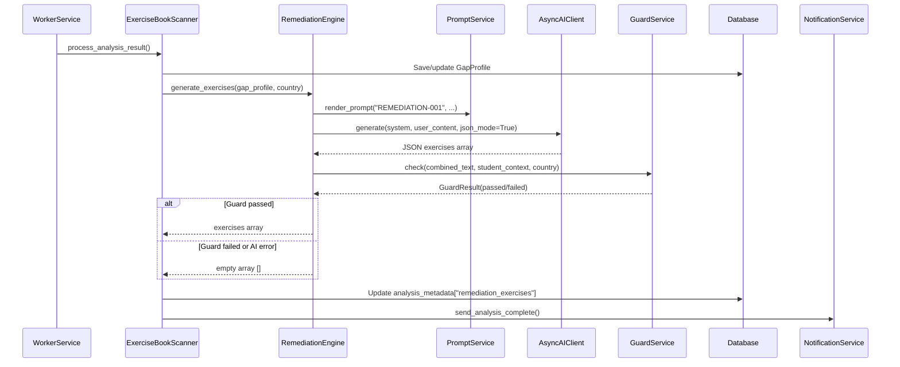

# Design Document: Teacher Remediation Exercises

## Overview

This feature adds automatic generation of teacher-facing remediation sample questions after exercise book analysis completes. When `ExerciseBookScanner.process_analysis_result()` saves a GapProfile with gap nodes, a new `RemediationEngine` service invokes the REMEDIATION-001 prompt to produce 3–5 sample questions per gap node. The exercises are validated through GUARD-001, stored in the GapProfile's `analysis_metadata` JSONB under `"remediation_exercises"`, and surfaced through the existing Reports API and teacher dashboard.

The design reuses the existing `PromptService`, `GuardService`, and `AsyncAIClient` infrastructure. No new database tables or migrations are required — exercises are stored as a JSONB key on the existing `GapProfile` model.

### Key Design Decisions

1. **Inline generation (not async queue)**: Exercises are generated within `process_analysis_result()` before teacher notification, keeping the flow synchronous and avoiding a separate worker task. This is acceptable because the AI call adds ~2-4s and the teacher notification already waits for profile save.
2. **JSONB storage over separate table**: Exercises are tightly coupled to a single GapProfile snapshot. A separate table would add join complexity with no querying benefit at MVP scale.
3. **Fail-open for exercises**: Unlike GUARD-001 (fail-closed for parent messages), exercise generation failure should not block the pipeline. The teacher still gets their gap analysis; exercises are a bonus.
4. **Single prompt call per profile**: Rather than one AI call per gap node, we batch all gap nodes into a single REMEDIATION-001 call to reduce latency and cost.

## Architecture



### Component Placement

- `RemediationEngine` → `gapsense/src/gapsense/engagement/remediation_engine.py` (new file, same package as `ExerciseBookScanner`)
- REMEDIATION-001 prompt → added to both copies of `gapsense_prompt_library_v2.0_multicountry.json`
- API changes → `gapsense/src/gapsense/web/demo.py` (existing endpoints modified)
- Frontend changes → existing `page.tsx` files in `gap-sense-frontend/app/demo/reports/`

## Components and Interfaces

### RemediationEngine (New)

```python
@dataclass
class RemediationExercise:
    question: str
    expected_answer: str
    teacher_note: str
    gap_node_code: str

class RemediationEngine:
    PROMPT_ID = "REMEDIATION-001"

    def __init__(
        self,
        *,
        ai_client: AsyncAIClient,
        prompt_service: PromptService,
        guard_service: GuardService,
    ) -> None: ...

    async def generate_exercises(
        self,
        *,
        gap_nodes: list[dict],  # [{code, title, error_patterns, misconception}]
        student_grade: str,
        country: str,
        language: str = "en",
    ) -> list[dict]:
        """Generate remediation exercises for gap nodes.

        Returns list of exercise dicts or empty list on failure.
        """
```

**Flow**:
1. Render REMEDIATION-001 with gap node details, grade, country
2. Call AI client with `json_mode=True`
3. Parse response into exercise list
4. Concatenate all exercise text, pass to `GuardService.check()`
5. If guard passes → return exercises; if fails → log + return `[]`
6. On any exception → log + return `[]` (fail-open)

### ExerciseBookScanner (Modified)

`process_analysis_result()` gains a new dependency on `RemediationEngine` and calls it after saving the GapProfile but before sending the teacher notification.

```python
class ExerciseBookScanner:
    def __init__(self, ..., remediation_engine: RemediationEngine) -> None:
        self._remediation_engine = remediation_engine

    async def process_analysis_result(self, ...) -> None:
        # ... existing: save GapProfile ...

        # NEW: Generate remediation exercises
        exercises = await self._remediation_engine.generate_exercises(
            gap_nodes=gap_node_details,
            student_grade=student.current_grade,
            country=country,
        )
        # Store in analysis_metadata
        metadata["remediation_exercises"] = exercises
        # Update profile
        profile.analysis_metadata = metadata
        await self.db.commit()

        # ... existing: send notification ...
```

### REMEDIATION-001 Prompt (New)

Added to the prompt library JSON with:
- `category`: `"teacher_remediation"`
- `status`: `"active"`
- `model`: `"claude-sonnet-4-6"`
- `temperature`: `0.4`
- `max_tokens`: `2048`
- Template parameters: `country`, `curriculum_authority`, `gap_node_code`, `gap_node_title`, `student_grade`, `error_patterns`, `misconception_description`
- Output: JSON array of `{question, expected_answer, teacher_note, gap_node_code}` objects
- System prompt instructs 3–5 questions per gap node, classroom-appropriate, with teacher notes explaining targeted misconceptions

### Reports API (Modified)

**`GET /demo/api/reports/{teacher_phone}/student/{student_id}`**:
- Add `remediation_exercises` array from `analysis_metadata` to the response under `report.remediation_exercises`

**`GET /demo/api/reports/{teacher_phone}`**:
- Add `remediation_exercise_count` integer to each student object
- Add `remediation_exercise_count` to the `latest_analysis` object

### Frontend (Modified)

**Student Detail Page** (`[phone]/student/[id]/page.tsx`):
- New `RemediationExercises` section after the gap nodes card
- Exercises grouped by `gap_node_code` with gap node title as heading
- Each exercise shows question, expected answer, and teacher note
- Section hidden when `remediation_exercises` is empty/absent

**Teacher Dashboard** (`[phone]/page.tsx`):
- Badge on student cards showing exercise count when > 0
- Exercise count in latest analysis section

## Data Models

### Remediation Exercise Schema (JSONB, no migration)

Stored at `GapProfile.analysis_metadata["remediation_exercises"]`:

```json
[
  {
    "question": "If 3/4 of a group of 12 mangoes is shared equally...",
    "expected_answer": "9 mangoes",
    "teacher_note": "Tests whether student can apply fraction-of-a-whole concept. Common misconception: treating numerator as the answer.",
    "gap_node_code": "B4.1.5.2"
  }
]
```

**Field constraints**:
- `question`: non-empty string
- `expected_answer`: non-empty string
- `teacher_note`: non-empty string
- `gap_node_code`: string matching a valid curriculum node code from the GapProfile's `gap_nodes`

### API Response Additions

**Student report response** — new top-level key:
```json
{
  "report": {
    "...existing fields...",
    "remediation_exercises": [
      {
        "question": "...",
        "expected_answer": "...",
        "teacher_note": "...",
        "gap_node_code": "B4.1.5.2"
      }
    ]
  }
}
```

**Teacher dashboard response** — additions:
```json
{
  "latest_analysis": {
    "...existing fields...",
    "remediation_exercise_count": 5
  },
  "students": [
    {
      "...existing fields...",
      "remediation_exercise_count": 5
    }
  ]
}
```


## Correctness Properties

*A property is a characteristic or behavior that should hold true across all valid executions of a system — essentially, a formal statement about what the system should do. Properties serve as the bridge between human-readable specifications and machine-verifiable correctness guarantees.*

### Property 1: Prompt library copies are identical

*For any* prompt entry in the prompt library, the content at `gapsense/data/prompts/gapsense_prompt_library_v2.0_multicountry.json` and `gapsense-data/prompts/gapsense_prompt_library_v2.0_multicountry.json` should be byte-identical.

**Validates: Requirements 1.5**

### Property 2: Exercise generation and storage round trip

*For any* GapProfile with one or more gap nodes, after `process_analysis_result()` completes, the GapProfile's `analysis_metadata["remediation_exercises"]` should contain a non-empty list when the AI call and guard check both succeed, and the exercises should reference only gap node codes present in the profile's gap nodes.

**Validates: Requirements 2.1, 3.1**

### Property 3: Rendered prompt contains all gap node data

*For any* set of gap node details (codes, titles, error patterns, misconception descriptions) and student grade, the rendered REMEDIATION-001 prompt text should contain every provided gap node code and gap node title.

**Validates: Requirements 2.2**

### Property 4: AI failure does not block pipeline

*For any* AI client failure (exception, timeout, None response) during exercise generation, `process_analysis_result()` should still complete successfully and the teacher notification should still be sent.

**Validates: Requirements 2.3**

### Property 5: Exercise objects have required schema fields

*For any* exercise object in the `remediation_exercises` array, it must contain non-empty string values for all four fields: `question`, `expected_answer`, `teacher_note`, and `gap_node_code`.

**Validates: Requirements 3.2**

### Property 6: Rendered exercises display all fields

*For any* non-empty `remediation_exercises` array passed to the student detail component, the rendered output should contain the `question`, `expected_answer`, `teacher_note`, and `gap_node_code` of every exercise.

**Validates: Requirements 4.1, 4.2**

### Property 7: Exercises are grouped by gap node code

*For any* set of remediation exercises with multiple distinct `gap_node_code` values, the rendered output should group exercises under their respective gap node code headings, and exercises within the same group should share the same `gap_node_code`.

**Validates: Requirements 4.3**

### Property 8: Dashboard shows exercise count for students with exercises

*For any* student with a `remediation_exercise_count` greater than zero, the teacher dashboard should display the count value and a visual indicator on that student's card.

**Validates: Requirements 5.1, 5.2**

### Property 9: API response includes exercises and correct count

*For any* GapProfile with N remediation exercises, the student report API response should include all N exercises in `remediation_exercises`, and the teacher dashboard API response should include `remediation_exercise_count` equal to N for that student.

**Validates: Requirements 6.1, 6.2**

### Property 10: Guard service gates exercise storage

*For any* set of generated exercises, if `GuardService.check()` returns `passed=False`, the stored `remediation_exercises` should be an empty array. If `GuardService.check()` returns `passed=True`, the exercises should be stored as generated.

**Validates: Requirements 7.1, 7.2**

## Error Handling

| Scenario | Behavior | Stored Value |
|---|---|---|
| AI client returns `None` | Log warning, continue pipeline | `"remediation_exercises": []` |
| AI client raises exception | Log error with traceback, continue pipeline | `"remediation_exercises": []` |
| AI response is not valid JSON | Log parse error, continue pipeline | `"remediation_exercises": []` |
| AI response missing required fields | Filter out malformed exercises, store valid ones | Partial array or `[]` |
| GuardService rejects exercises | Log guard violations | `"remediation_exercises": []` |
| GuardService unavailable (AI down) | Fail-closed per guard semantics, log | `"remediation_exercises": []` |
| GapProfile has zero gap nodes | Skip remediation engine entirely | `"remediation_exercises": []` |
| Prompt rendering fails (missing country) | Log error, continue pipeline | `"remediation_exercises": []` |

All error paths are fail-open for the exercise feature (pipeline continues, teacher gets notification) but fail-closed for content safety (guard rejection → empty exercises).

## Testing Strategy

### Property-Based Testing

Library: **Hypothesis** (Python, already in use in the project for `test_prompt_service_pbt.py` and `test_guard_service_pbt.py`)

Each property test runs a minimum of 100 iterations with generated inputs.

**Backend property tests** (`gapsense/tests/unit/test_remediation_engine_pbt.py`):
- Property 2: Generate random gap node lists, mock AI to return valid exercises, verify storage round trip
- Property 3: Generate random gap node details, render prompt, verify all codes/titles present
- Property 4: Generate random failure modes, verify pipeline completion
- Property 5: Generate random AI responses, verify schema validation filters correctly
- Property 10: Generate random exercises + guard pass/fail, verify storage outcome

**Frontend property tests** (if fast-check is available, otherwise unit tests):
- Property 6: Generate random exercise arrays, render component, verify all fields present
- Property 7: Generate random exercises with multiple gap codes, verify grouping
- Property 8: Generate random student data with varying counts, verify badge rendering

Each test tagged with: `# Feature: teacher-remediation-exercises, Property {N}: {title}`

### Unit Tests

**Backend** (`gapsense/tests/unit/test_remediation_engine.py`):
- Example: REMEDIATION-001 prompt exists in library with correct category and status (validates 1.1–1.4)
- Example: Both prompt library copies are identical (validates 1.5, also covered by Property 1)
- Example: `generate_exercises()` with 2 gap nodes returns exercises for both codes
- Edge case: `generate_exercises()` with empty gap nodes returns `[]` (validates 3.3)
- Edge case: Empty/absent `remediation_exercises` results in `[]` in API response (validates 6.3)
- Example: Exercise generation happens before notification (validates 2.4)

**API** (`gapsense/tests/api/test_reports_remediation.py`):
- Example: Student report endpoint includes `remediation_exercises` array
- Example: Teacher dashboard endpoint includes `remediation_exercise_count`
- Edge case: Student with no exercises returns empty array and count 0

**Frontend** (`gap-sense-frontend/__tests__/`):
- Example: Remediation section not rendered when exercises absent (validates 4.4)
- Example: Remediation section renders correctly with sample data
- Example: Student card badge shows when exercises exist
